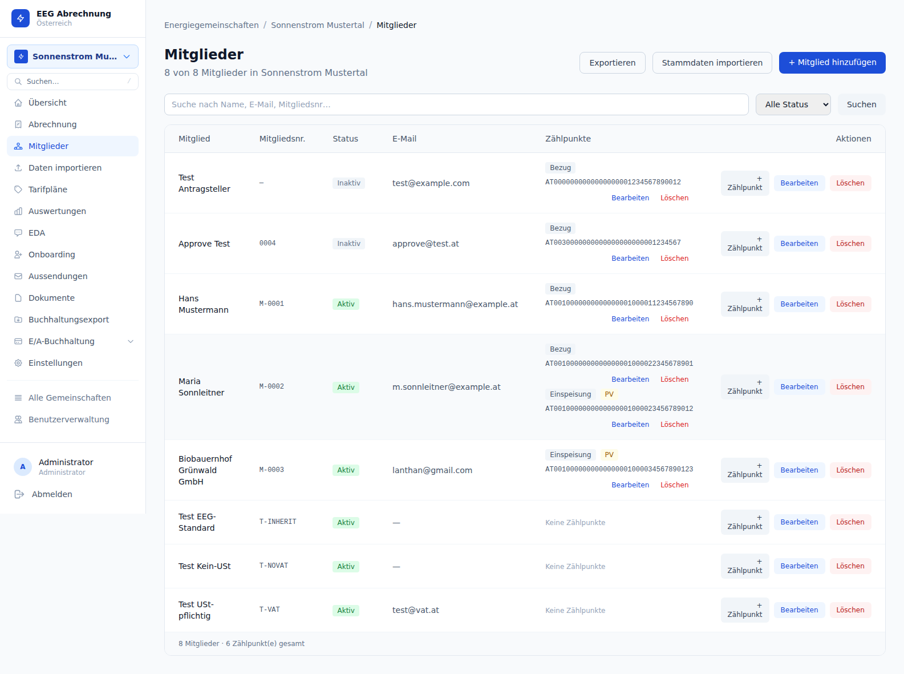
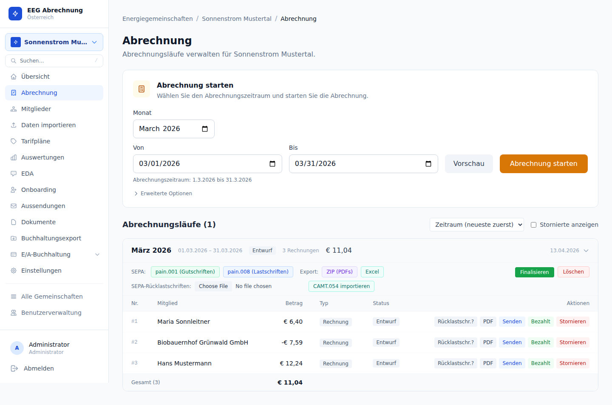
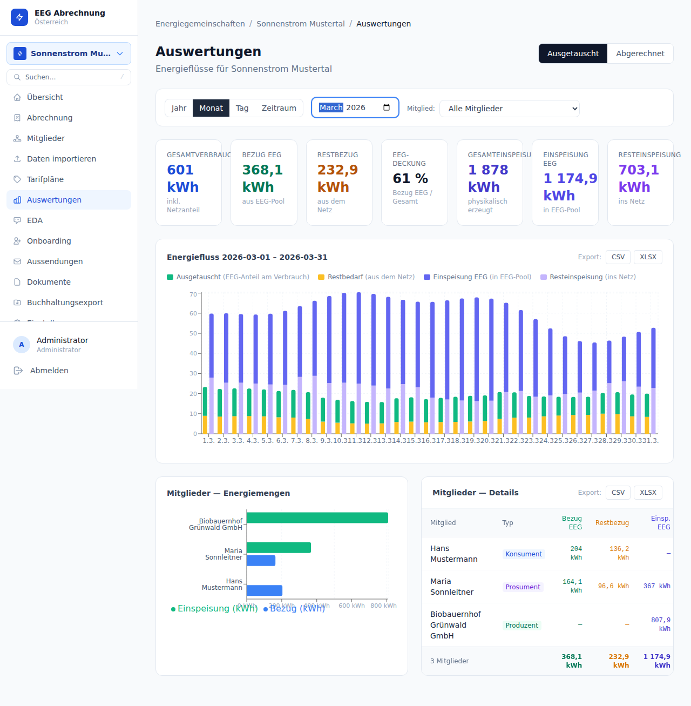
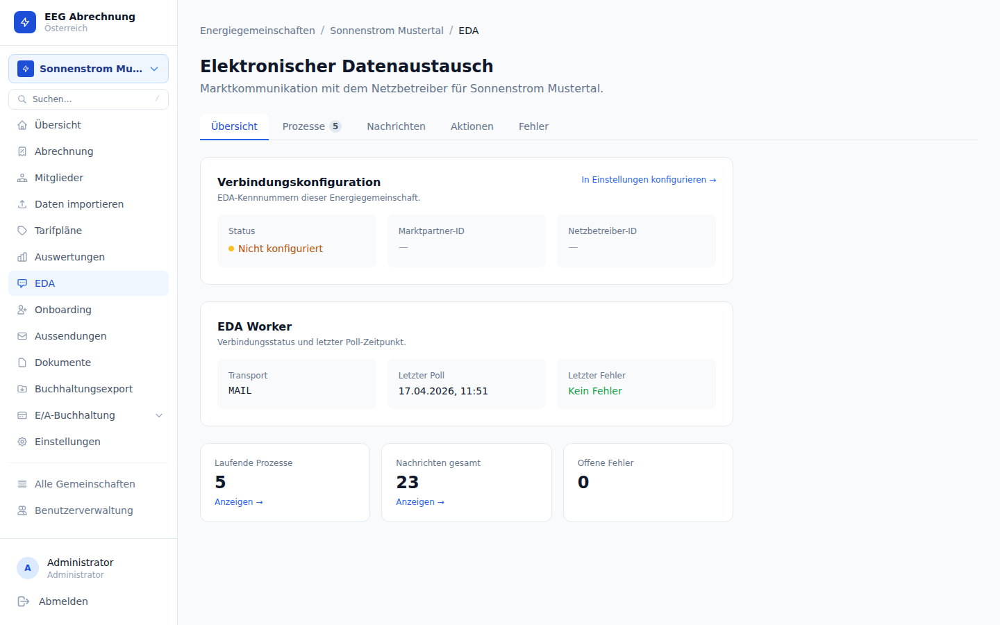
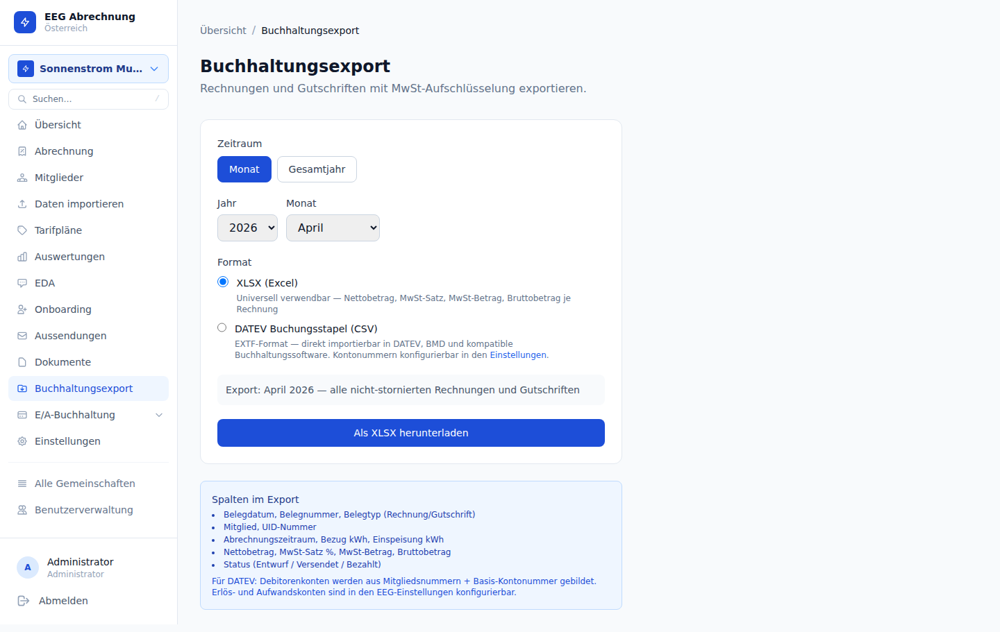
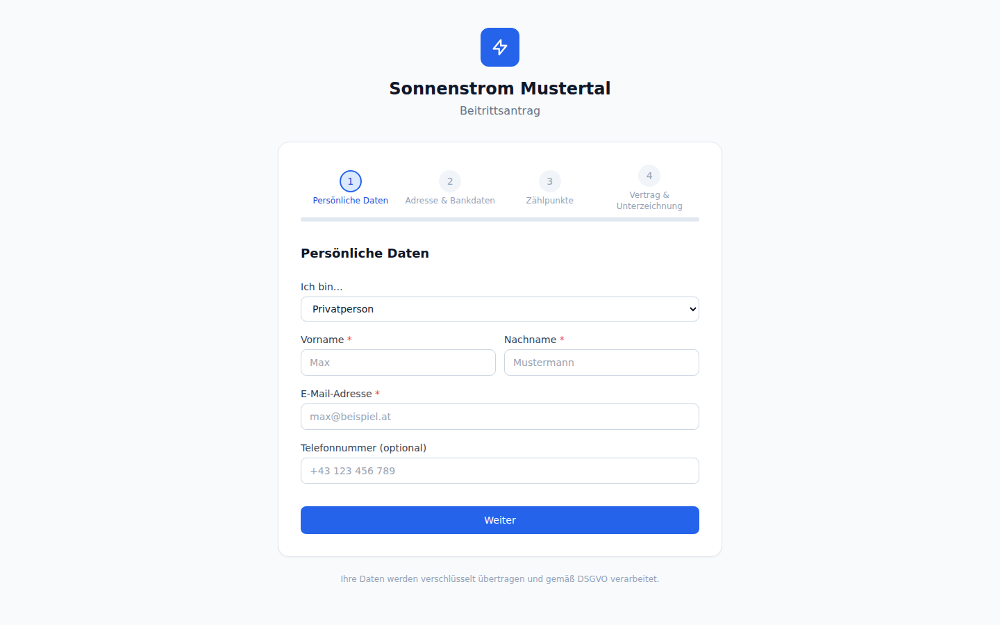

# eegabrechnung

Selbst gehostete Abrechnungsplattform für österreichische Energiegemeinschaften:
Mitglieder, Zählpunkte, Energiedaten, Rechnungen, SEPA und EDA-Marktkommunikation in einem System.

Das Projekt ist für Betreiber gedacht, die ihre EEG nicht mit Excel, Mail-Threads und mehreren Insellösungen führen wollen, aber auch kein überdimensioniertes ERP einführen möchten.

## Motivation

Energiegemeinschaften sind fachlich und gesellschaftlich eine sehr spannende Sache. In der Praxis ist die laufende Abrechnung aber oft überraschend aufwändig: Mitglieder, Zählpunkte, Energiedaten, Rechnungen, Gutschriften, SEPA und Marktkommunikation müssen sauber zusammenpassen.

Es gibt bereits kommerzielle Anbieter am Markt. Für größere Setups kann das sinnvoll sein. Für kleine Energiegemeinschaften werden die laufenden Abrechnungskosten aber oft unverhältnismäßig hoch und machen das Modell damit operativ unattraktiver, als es eigentlich sein müsste.

Auch bestehende Open-Source- oder Source-Available-Ansätze haben mich persönlich nicht überzeugt. `eegfaktura` war für mich kein guter Ausgangspunkt, weil es nach meinem Eindruck nicht wirklich `out of the box` lief, wenn man das Repository einfach von GitHub klont, und weil mir dort einige Komfortfunktionen gefehlt haben, die ich in `eegabrechnung` für den echten Betrieb wichtig finde.

Genau aus dieser Motivation ist `eegabrechnung` entstanden: ein Werkzeug, das für reale österreichische Energiegemeinschaften praktikabel ist, selbst gehostet werden kann und gerade auch für kleinere Betreiber eine vernünftige Alternative sein soll.

## Für wen das gedacht ist

- kleine bis mittlere Energiegemeinschaften in Österreich
- Vereine, Hausgemeinschaften und Initiativen mit wenig interner IT-Kapazität
- Dienstleister, die EEGs technisch oder operativ betreuen
- Betreiber, die ein selbst hostbares System mit nachvollziehbarem Datenmodell wollen

## Was das Tool heute abdeckt

- Mitglieder- und Zählpunktverwaltung
- XLSX-Import und automatische EDA-Datenübernahme
- Tarifpläne und periodische Abrechnung
- PDF-Rechnungen, Gutschriften und SEPA-Dateien
- DATEV/XLSX-Buchhaltungsexport
- Einnahmen-Ausgaben-Buchhaltung für Vereine (wirtschaftlicher Geschäftsbetrieb, bis € 700.000 Umsatz)
- Onboarding-Portal für neue Mitglieder
- passwortloses Mitgliederportal
- EDA-Prozesse für Anmeldung, Widerruf, Teilnahmefaktor und Datenanforderung
- E-Mail-Kampagnen an Mitglieder mit Platzhaltersubstitution und Anhängen
- Zählpunkt-Notizen und SEPA-Mandat-PDF

## Screenshots

Die folgenden Screenshots stammen aus der Demo-EEG im System.

### Dashboard


### Mitglieder und Zählpunkte



### Abrechnung



### Auswertungen



### EDA-Prozesse



### Buchhaltung



### Öffentliches Onboarding



## Warum das für EEGs interessant ist

Eine EEG hat typischerweise dieselben operativen Reibungen:

- Mitgliedsdaten und Zählpunkte müssen konsistent bleiben
- Netzbetreiber-Daten kommen unregelmäßig und in verschiedenen Formaten
- Rechnungen, Gutschriften und Lastschriften müssen nachvollziehbar sein
- Marktkommunikation über EDA ist fachlich nötig, aber operativ mühsam
- für kleine Betreiber sind klassische ERP- oder Utility-Systeme oft zu schwergewichtig

`eegabrechnung` adressiert genau diesen Bereich: schlanke, selbst hostbare EEG-Verwaltung mit Fokus auf Österreich und auf reale operative Workflows.

## Funktionsüberblick

### Mitglieder und Zählpunkte

- Stammdaten inkl. IBAN, UID, Beitritts- und Austrittsdatum
- automatische Mitgliedsnummern
- Lebenszyklus-Status für Mitglieder und Zählpunkte
- Notizfeld pro Zählpunkt
- Mehrfachteilnahme nach EAG
- automatischer Widerrufs-Workflow (CM_REV_SP) für austretende Mitglieder

### Energiedaten

- XLSX-Import mit Vorschau und Konflikterkennung
- automatische Übernahme eingehender EDA-Messdaten
- historische Datenanforderung beim Netzbetreiber
- Datenabdeckung und Lücken-Erkennung

### Abrechnung und Rechnungen

- Tarifpläne mit verschiedenen Granularitäten
- Abrechnungsläufe mit Zeitraumsschutz
- Draft-, Finalisierungs- und Storno-Workflow
- PDF-Rechnungen und Gutschriften
- automatischer Mailversand
- SEPA pain.001 (Überweisung) und pain.008 (Lastschrift)
- SEPA-Mandat-PDF mit Voranmeldungsfrist (konfigurierbar, Standard 14 Tage)

### Buchhaltung und Auswertung

- DATEV-Export
- XLSX-Buchungsjournal
- Energieberichte pro EEG und pro Mitglied
- OeMAG-Marktpreisintegration

### Einnahmen-Ausgaben-Buchhaltung

EEGs als Verein können ihre steuerliche Buchhaltung direkt im System führen:

- Kontenplan mit konfigurierbaren Konten (Einnahmen, Ausgaben, Sonstig)
- Buchungsjournal mit Belegdatum, Zahlungsdatum und Beleg-Upload
- Saldenliste und Jahresabschluss (Überschussrechnung nach §4 Abs. 3 EStG)
- Umsatzsteuervoranmeldung (UVA) mit Kennzahlen und FinanzOnline-XML-Export
- Jahreserklärungen U1 und K1 als Datenbasis
- automatischer Import von EEG-Ausgangsrechnungen als Buchungen
- Bankimport (MT940/CAMT.053) mit Buchungszuordnung
- Unterstützung für Reverse Charge (§2 Z 2 UStBBKV und §22 UStG)
- Audit-Trail für alle Buchungsänderungen (Anlegen, Ändern, Löschen) nach BAO §131; Soft-Delete mit Pflichtangabe eines Löschgrunds; EEG-weites Änderungsprotokoll

### Onboarding und Portal

- öffentliches Beitrittsformular mit E-Mail-Verifizierung und SEPA-Mandat-Erfassung
- Admin-Freigabe und automatische Anlage von Mitgliedern und Zählpunkten
- Mitgliederportal mit Magic Link, Rechnungen und Energieübersicht (wahlweise eigene Quote oder volle EEG-Energie)
- E-Mail-Kampagnen an Mitglieder mit Zielgruppenauswahl, Platzhaltern und Anhängen

### EDA-Marktkommunikation

Die aktuelle Implementierung orientiert sich im Wesentlichen direkt an den tatsächlich verwendeten EDA-Prozessnamen und Nachrichtencodes. Im Zentrum stehen derzeit Online-/Offline-Anmeldung, Teilnahmefaktoränderung, Zählpunktlistenabfrage, Messdatenanforderung und Zustimmungswiderruf.

### Ausgehende EDA-Prozesse

| Interner Prozessname | Tatsächlich erzeugte Nachricht | Was der Prozess fachlich tut |
|---|---|---|
| `EC_REQ_ONL` | `CMRequest 01.30` mit `MessageCode=ANFORDERUNG_ECON` | Startet die Online-Anmeldung eines Zählpunkts zur Energiegemeinschaft. |
| `EC_PRTFACT_CHG` | `ECMPList 01.10` mit `MessageCode=ANFORDERUNG_CPF` | Ändert den Teilnahmefaktor eines bereits zugeordneten Zählpunkts. |
| `EC_REQ_PT` | `CPRequest 01.12` mit `MessageCode=ANFORDERUNG_PT` | Fordert historische Zählpunktdaten bzw. Messwerte für einen Zeitraum an. |
| `EC_PODLIST` | `CPRequest 01.12` mit `MessageCode=ANFORDERUNG_ECP` | Fordert die aktuelle Zählpunktliste der Energiegemeinschaft beim Netzbetreiber an. |
| `CM_REV_SP` | `CMRevoke 01.10` mit `MessageCode=AUFHEBUNG_CCMS` | Widerruft eine zuvor erteilte Zustimmung. Dieser Prozess wird insbesondere beim Austritt eines Mitglieds verwendet und setzt eine gespeicherte `ConsentId` voraus. |

Im SMTP-Betreff werden dazu aktuell diese edanet-`Prozess-Id`-Mappings verwendet: `EC_PRTFACT_CHANGE_01.00`, `EC_REQ_ONL_02.30`, `CR_REQ_PT_04.10`, `EC_PODLIST_01.00` und `CM_REV_SP_01.00`.

### Eingehende EDA-Nachrichten

| Eingehende Nachricht | Was die Verarbeitung im System tut |
|---|---|
| `CMNotification` | Verarbeitet Rückmeldungen im Anmelde- und Widerrufspfad: `ANTWORT_ECON` als Zwischenrückmeldung, `ZUSTIMMUNG_ECON` als Zustimmung, `ABLEHNUNG_ECON` als Ablehnung sowie `AUFHEBUNG_CCMS_OK` bzw. `AUFHEBUNG_CCMS_ABGEL` für den Widerruf. |
| `CPDocument` | Verarbeitet Status- und Bestätigungsnachrichten des Netzbetreibers wie `ERSTE_ANM`, `FINALE_ANM`, `ABSCHLUSS_ECON` und Ablehnungen und setzt den zugehörigen Prozessstatus entsprechend. |
| `ECMPList` | Verarbeitet `SENDEN_ECP` als Antwort bzw. Push der aktuellen Zählpunktliste und backfilled dabei fehlende `ConsentId`s. `ABSCHLUSS_ECON` bestätigt final eine Anmeldung und aktualisiert u. a. `registriert_seit` und `ConsentId`. |
| `DATEN_CRMSG` | Importiert eingehende Messdaten in das System und schließt zugehörige Datenanforderungen ab. |
| `CM_REV_CUS` (`AUFHEBUNG_CCMS`) | Kunde widerruft seine Zustimmung über den Netzbetreiber. Markiert den ursprünglichen Anmeldeprozess als `completed`, setzt `abgemeldet_am` auf dem Zählpunkt aus dem `ConsentEnd`-Datum. |
| `CM_REV_IMP` (`AUFHEBUNG_CCMS_IMP`) | Netzbetreiber hebt die Anmeldung wegen Unmöglichkeit auf (z. B. Zählpunkt-Übertragung). Gleiche Effekte wie `CM_REV_CUS`, zusätzlich wird eine Operator-E-Mail zur Information versendet. |
| `EDASendError` | Verarbeitet Gateway- oder Versandfehler und markiert den betroffenen Prozess bzw. die Nachricht als Fehlerfall. |

Fachlich wichtig: Die Abmeldung erfolgt ausschließlich über den Zustimmungswiderruf `CM_REV_SP` beziehungsweise den Mitglieder-Austritt, der daraus automatisch Widerrufe für alle aktiven Zählpunkte erzeugt. Eine gespeicherte `ConsentId` (aus der Anmeldebestätigung) ist dafür Voraussetzung.

Hinweis: Eine Ponton-XP-Anbindung ist im Code angelegt, aber derzeit nicht als produktionsreif dokumentiert.

## Architektur in Kurzform

- `web/`: Next.js 16 Frontend
- `api/`: Go REST API
- `api/cmd/worker/`: separater EDA-Worker
- `docker-compose.yaml`: Postgres, API, Web, optionale Profile für EDA, Caddy und Tests

Der Standardweg ist Selbsthosting via Docker Compose.

## Welche Infrastruktur man dafür braucht

Für den Betrieb braucht es keine große Spezialinfrastruktur. In vielen Fällen reicht bereits:

- ein kleiner VPS
- oder ein eigener Server bzw. Mini-PC zuhause
- Docker und Docker Compose
- genügend Speicherplatz für Datenbank, Dokumente und Rechnungs-PDFs

Für kleine bis mittlere Energiegemeinschaften ist der Ressourcenbedarf grundsätzlich überschaubar. Wichtiger als rohe Rechenleistung sind ein stabiler Betrieb und eine saubere Datensicherung.

Besonders wichtig ist:

- regelmäßige Backups der PostgreSQL-Datenbank
- Sicherung der erzeugten Dokumente und Rechnungs-PDFs
- Aufbewahrung der `.env`-Konfiguration und Secrets an einem sicheren Ort
- idealerweise ein getesteter Restore-Prozess, nicht nur ein Backup

Wer das System zuhause hostet, sollte zusätzlich auf Stromausfallsicherheit, Internetverfügbarkeit und externe Backups achten. Für viele produktive Setups ist deshalb ein kleiner VPS oder dedizierter Server mit sauberer Backup-Strategie meist der robustere Weg.

## Schnellstart

### Voraussetzungen

- Docker
- Docker Compose v2

### Minimaler Start

```bash
git clone https://github.com/lutzerb/eegabrechnung
cd eegabrechnung
cp .env.example .env
```

Danach in `.env` mindestens diese Werte setzen:

- `JWT_SECRET`
- `NEXTAUTH_SECRET`
- `CREDENTIAL_ENCRYPTION_KEY`
- `POSTGRES_PASSWORD`

Empfohlene Erzeugung:

```bash
openssl rand -base64 32   # für JWT_SECRET
openssl rand -base64 32   # für NEXTAUTH_SECRET
openssl rand -base64 32   # für CREDENTIAL_ENCRYPTION_KEY
```

Dann starten:

```bash
docker compose up --build -d
```

### Standard-URLs lokal

| Service | URL |
|---|---|
| Frontend | http://localhost:3001 |
| API | http://localhost:8101 |
| Postgres | localhost:26433 |

### Erster Login

Der aktuelle Standard-Admin aus den Migrationen ist:

- E-Mail: `admin@eeg.at`
- Passwort: `admin`

Für einen echten öffentlichen oder produktiven Betrieb sollte das Passwort unmittelbar geändert werden.

## Optionale Compose-Profile

| Profil | Zweck |
|---|---|
| `eda` | produktiver EDA-Worker |
| `caddy` | Reverse Proxy mit TLS |
| `cloudflare` | Cloudflare Tunnel (kein offener Port nötig) |
| `test` | Integrations-Teststack mit Mailpit und FILE-Worker |
| `demo` | Demo-Reset-Job |

Beispiele:

```bash
docker compose --profile eda up -d
docker compose --profile caddy up -d
docker compose --profile cloudflare up -d
docker compose --profile test up -d
```

## Dokumentation

Ausführlichere Dokumentation liegt unter `docs/`, unter anderem:

- [Installation](docs/01-installation.md)
- [Erste Schritte](docs/02-erste-schritte.md)
- [Abrechnung](docs/07-abrechnung.md)
- [Buchhaltung](docs/09-buchhaltung.md)
- [SEPA](docs/10-sepa.md)
- [EDA](docs/11-eda.md)
- [Mitgliederportal](docs/13-mitgliederportal.md)

## Tests

Das Repo enthält:

- Go-Unit-Tests in `api/internal/...`
- einen Python-Integrationstest-Harness unter `test/`

Der Integrationstest-Harness läuft gegen den Docker-Stack und deckt Billing, SEPA, EDA, Onboarding, Import und Accounting ab.

## Roadmap

Das Tool ist momentan stark auf lokale und regionale Energiegemeinschaften ausgelegt. Prinzipiell sollte es aber auch für gemeinschaftliche Erzeugungsanlagen funktionieren.

Themen, die als Nächstes spannend sind und bei denen ich mich auch über Beiträge freue:

- gemeinschaftliche Erzeugungsanlagen
- Ponton X/P-Anbindung
- Bürgerenergiegemeinschaften
  - hier gibt es zusätzliche Marktprozesse, die noch implementiert werden müssten
  - ich kann diesen Bereich derzeit selbst nicht realistisch testen, weil ich nur eine regionale EEG betreibe
- P2P-Austausch laut ElWOG-Novelle
  - fachlich besonders spannend im Hinblick auf die Änderungen ab Oktober 2026

## Grenzen und ehrliche Hinweise

- Das System ist stark auf den österreichischen EEG-Kontext zugeschnitten.
- Derzeit ist nur das dynamische Aufteilungsmodell implementiert. Eine statische Aufteilung ist aktuell nicht implementiert.
- EDA per Mail ist der primäre reale Betriebsweg.
- Ponton ist derzeit kein offiziell produktionsreifer Standardpfad.
- Wer das Tool öffentlich oder produktiv betreibt, sollte TLS, Backups, Monitoring und Secret-Management sauber selbst aufsetzen.

## Support

Das Projekt ist derzeit auf `best effort`-Basis gedacht:

- Issues für reproduzierbare Bugs
- Pull Requests für konkrete Verbesserungen
- keine garantierten Reaktionszeiten

## Lizenz

Dieses Repository ist **source-available** unter:

- GNU AGPL v3.0 only
- plus Commons Clause License Condition v1.0

Wichtig: Diese Kombination ist **nicht** OSI-open-source. Details stehen in [LICENSE](LICENSE) und [LICENSE-AGPL-3.0.txt](LICENSE-AGPL-3.0.txt).

### Praktisch gesprochen

Erlaubt ist insbesondere:

- Nutzung der Software durch Energiegemeinschaften jeglicher Rechtsform für den eigenen Betrieb
- Selbsthosting und interner Einsatz durch Vereine, Genossenschaften, GmbHs, Gemeinden oder sonstige EEG-Träger
- Anpassung des Codes für den eigenen Einsatz
- Weiterentwicklung und Beiträge zum Projekt im Rahmen der Lizenz

Nicht erlaubt ist insbesondere:

- ein SaaS-Angebot auf Basis dieses Codes, für das Dritte bezahlen
- die Organisation oder Durchführung von Abrechnung für Energiegemeinschaften als bezahlte Dienstleistung auf Basis dieser Software
- Hosting-, Consulting- oder Support-Angebote, deren wirtschaftlicher Wert im Wesentlichen aus dieser Software abgeleitet wird, ohne gesonderte Vereinbarung mit dem Rechteinhaber

Diese Beispiele sind nur eine alltagsnahe Zusammenfassung. Maßgeblich ist der Lizenztext in [LICENSE](LICENSE).
