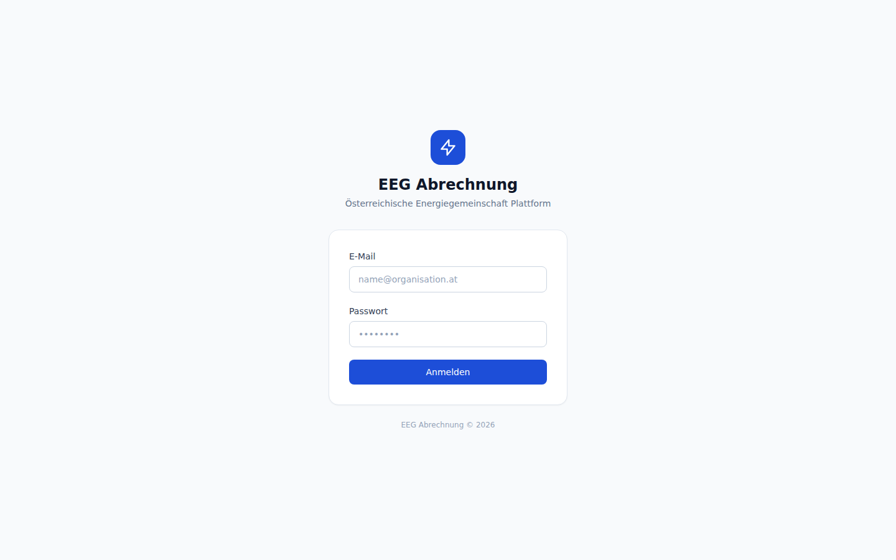
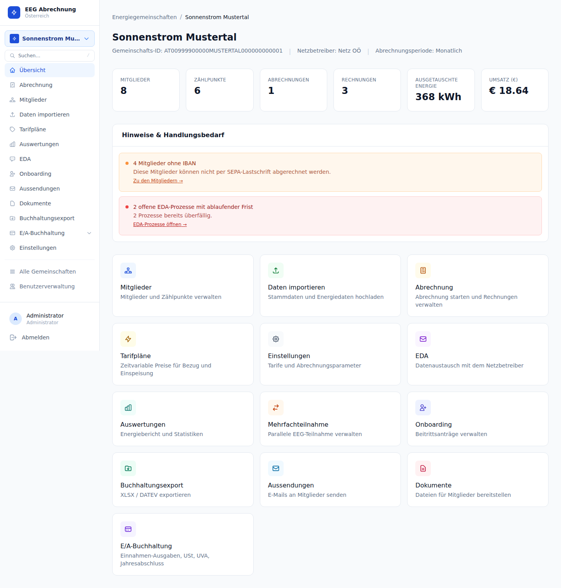
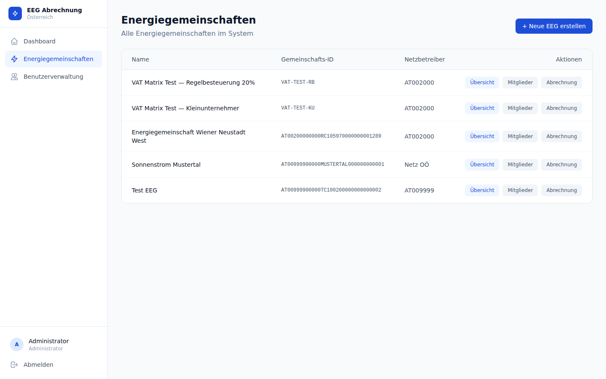

# Kapitel 2: Erste Schritte

## 2.1 Login

Rufen Sie die Anwendung im Browser auf:

```
http://localhost:3001
```

Melden Sie sich mit den Standard-Zugangsdaten an:

| Feld | Wert |
|------|------|
| E-Mail | `admin@eeg.at` |
| Passwort | `admin` |



<div class="warning">

Ändern Sie das Administrator-Passwort unmittelbar nach der ersten Anmeldung. Das Standard-Passwort ist ausschließlich für die initiale Inbetriebnahme vorgesehen.

</div>

### Authentifizierungsarchitektur

Die Anwendung verwendet **next-auth v5** mit einem `CredentialsProvider` — es ist kein externer Identity-Provider (z. B. Keycloak) erforderlich. Der Ablauf:

1. Das Login-Formular sendet E-Mail und Passwort an den Go-API-Endpunkt `POST /api/v1/auth/login`.
2. Die API prüft das bcrypt-gehashte Passwort in der Datenbank.
3. Bei Erfolg signiert die API ein **HS256-JWT** mit dem `JWT_SECRET` und gibt es zurück.
4. next-auth speichert das Token in der verschlüsselten Session-Cookie.
5. Alle nachfolgenden API-Aufrufe senden das Token als `Authorization: Bearer <token>`-Header.

<div class="tip">

Das JWT hat eine Laufzeit von **8 Stunden**. Ein automatischer Refresh findet nicht statt. Nach Ablauf wird der Benutzer zur Anmeldeseite weitergeleitet und muss sich neu einloggen.

</div>

---

## 2.2 Navigationsstruktur

Nach dem Login gelangen Sie zur EEG-Übersicht. Nach Auswahl einer EEG erscheint die Hauptnavigation in der linken Seitenleiste.



| Bereich | Zweck |
|---------|-------|
| **Dashboard** | Schnellübersicht: aktuelle Kennzahlen, offene Prozesse |
| **Mitglieder** | Mitgliederverwaltung und Zählpunktzuordnung |
| **Import** | Energiedaten aus XLSX-Dateien importieren |
| **Tarifpläne** | Zeitreihen-Preisgestaltung konfigurieren |
| **Abrechnung** | Abrechnungsläufe erstellen, Rechnungen und Gutschriften verwalten |
| **Berichte** | Energieanalyse mit Jahr/Monat/Tag/15-min-Granularität, CSV/XLSX-Export |
| **Buchhaltung** | DATEV Buchungsstapel-Export (CSV und XLSX) |
| **SEPA** | pain.001- und pain.008-Dateien erzeugen |
| **EDA** | MaKo-Prozesse (Anmeldung, Abmeldung, Teilnahmefaktor) und Nachrichtenprotokoll |
| **Onboarding** | Genehmigungswarteschlange für Neumitglieder-Anträge |
| **Mehrfachteilnahme** | Verwaltung von Zählpunkten in mehreren EEGs gleichzeitig |
| **Einstellungen** | EEG-Konfiguration: Stammdaten, Rechnung, SEPA, EDA, Logo |
| **Benutzer** | Benutzerverwaltung (nur Administratoren) |

---

## 2.3 EEG-Übersicht

Nach dem Login sehen Sie die Liste aller EEGs, die Ihrer Organisation zugeordnet sind.



Jede Karte zeigt:
- Name der EEG
- Gemeinschafts-ID und Netzbetreiber
- Anzahl der aktiven Mitglieder und Zählpunkte

Klicken Sie auf eine EEG-Karte, um in das Dashboard dieser EEG zu wechseln.

---

## 2.4 Neue EEG anlegen

Über die Schaltfläche **"EEG anlegen"** auf der Übersichtsseite öffnen Sie das Anlageformular. Füllen Sie die Pflichtfelder aus:

| Feld | Beschreibung |
|------|-------------|
| **Name** | Bezeichnung der Energiegemeinschaft (z. B. "Sonnenstrom Mustertal") |
| **Netzbetreiber** | EDA-ID des zuständigen Netzbetreibers (wird für MaKo-Kommunikation benötigt) |
| **Abrechnungsperiode** | `monthly` (monatlich), `quarterly` (quartalsweise) oder `yearly` (jährlich) |
| **Gründungsdatum** | Offizielles Gründungsdatum der EEG gemäß EAG-Registrierung |

<div class="tip">

Die Abrechnungsperiode bestimmt den Standard-Zeitraum für neue Abrechnungsläufe. Sie kann nachträglich in den Einstellungen geändert werden, beeinflusst aber keine bereits erstellten Abrechnungsläufe.

</div>

Nach dem Speichern ist die EEG sofort in der Übersicht sichtbar und kann konfiguriert werden.

---

## 2.5 Multi-Tenancy

Die Anwendung unterstützt mehrere unabhängige Organisationen auf einer gemeinsamen Datenbankinstanz. Die Mandantentrennung erfolgt vollständig über die `organization_id` im JWT.

- Jeder Benutzer gehört genau einer Organisation an.
- Alle Datenbankabfragen (EEGs, Mitglieder, Rechnungen, Energiedaten usw.) sind automatisch nach der `organization_id` aus dem JWT gefiltert.
- Daten verschiedener Organisationen sind für einander nicht sichtbar — auch nicht bei direktem Datenbankzugriff über die API.

Die bei der Installation angelegte Standard-Organisation hat die feste UUID:

```
00000000-0000-0000-0000-000000000001
```

<div class="warning">

Es gibt keine organisationsübergreifende Superadmin-Ansicht in der Benutzeroberfläche. Datenbankadministration über mehrere Organisationen hinweg erfordert direkten PostgreSQL-Zugriff.

</div>

---

## 2.6 Token & Session

| Eigenschaft | Wert |
|-------------|------|
| Signierungsalgorithmus | HS256 |
| Token-Laufzeit | 8 Stunden |
| Automatischer Refresh | Nein |
| Speicherort | next-auth-Session-Cookie (verschlüsselt mit `AUTH_SECRET`) |

Das JWT enthält folgende Claims:

- `sub` — Benutzer-ID
- `org` — Organisations-ID (Grundlage der Mandantentrennung)
- `role` — Benutzerrolle (`admin` oder `user`)
- `exp` — Ablaufzeitpunkt

Nach Ablauf der 8 Stunden leitet next-auth den Benutzer automatisch zur Anmeldeseite um. Es findet kein stiller Token-Refresh statt. Für Langzeit-Sessions (z. B. Dashboard-Anzeige ohne Benutzerinteraktion) ist ein geplanter Re-Login oder eine Verlängerung der Token-Laufzeit über `JWT_SECRET`-Konfiguration erforderlich.

<div class="tip">

Für API-Direktzugriff (z. B. Skripte, Tests) kann ein Token manuell abgerufen werden:

```bash
TOKEN=$(curl -s -X POST http://localhost:8101/api/v1/auth/login \
  -H "Content-Type: application/json" \
  -d '{"email":"admin@eeg.at","password":"admin"}' \
  | python3 -c "import sys,json; print(json.load(sys.stdin)['token'])")

curl -H "Authorization: Bearer $TOKEN" http://localhost:8101/api/v1/eegs
```

</div>
