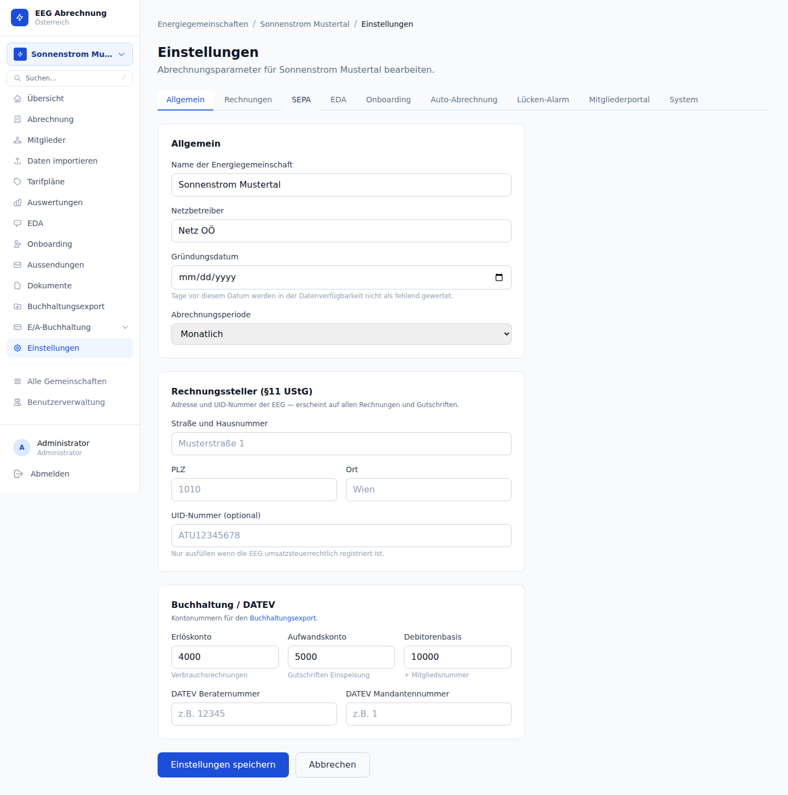
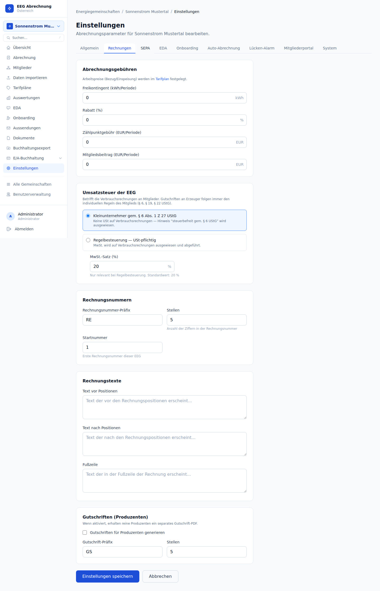
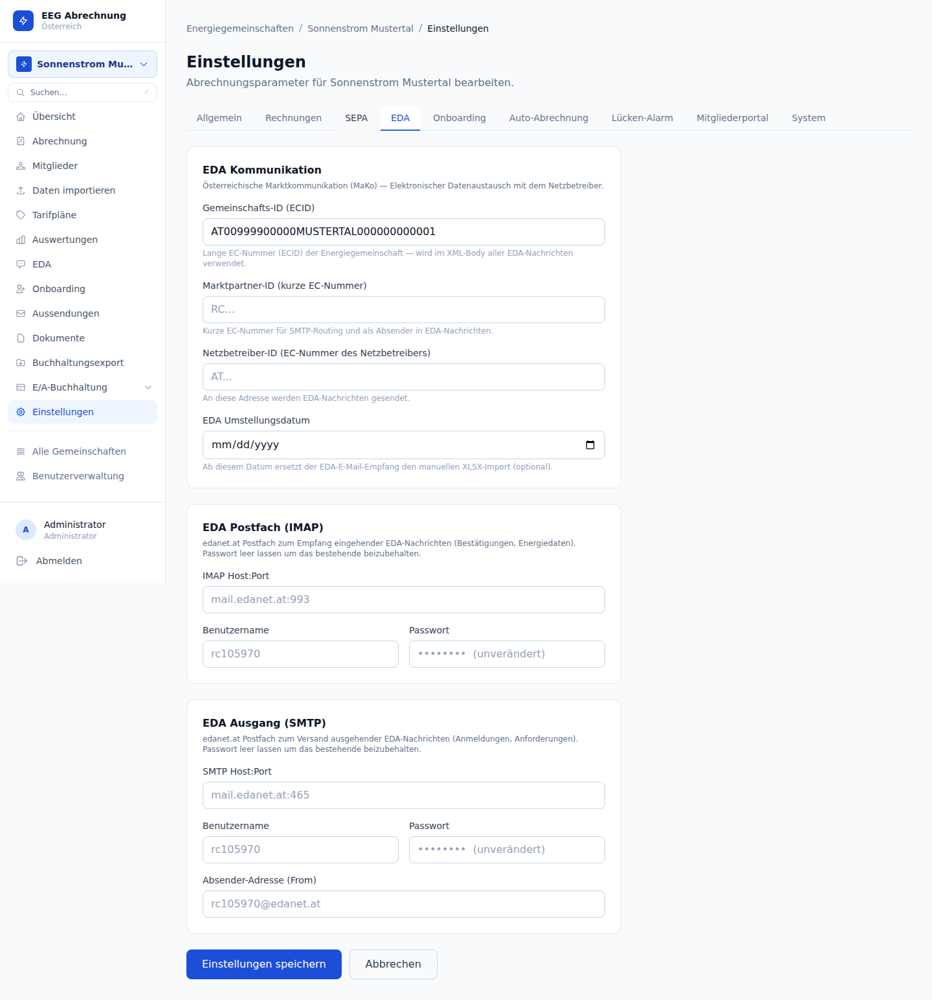

# 3 EEG verwalten

Alle Einstellungen einer Energiegemeinschaft sind unter `/eegs/{eegId}/settings` zusammengefasst. Die Seite ist in neun Tabs gegliedert; jede Änderung wird pro Tab separat gespeichert.

---

## 3.1 Tab Allgemein

### Stammdaten

| Feld | Pflicht | Beschreibung |
|------|---------|-------------|
| Name der Energiegemeinschaft | ja | Anzeigename in der Oberfläche |
| Netzbetreiber | nein | Freies Textfeld; informativ |
| Gründungsdatum | nein | Tage vor diesem Datum werden in der Datenverfügbarkeits-Timeline nicht als fehlend gewertet |
| Abrechnungsperiode | ja | `monthly` / `quarterly` / `semiannual` / `annual` |

### Demo-Modus

| Feld | Beschreibung |
|------|-------------|
| `is_demo` | Wenn aktiviert, wird kein E-Mail-Versand ausgelöst — weder Rechnungen noch EDA-Nachrichten noch Kampagnen. Nützlich für Testbetrieb ohne echte E-Mails. Im Demo-Betrieb erscheint ein Demo-Badge in der EEG-Übersicht. |

Der Demo-Modus lässt sich direkt in der EEG-Übersicht (`/eegs`) erkennen: Demo-EEGs werden mit einem orange/gelben Badge „Demo" markiert.

### Rechnungssteller (§ 11 UStG)

Die Adressfelder der EEG erscheinen auf **allen** Rechnungen und Gutschriften als Rechnungssteller-Block, wie es § 11 Abs. 1 Z 1 UStG vorschreibt.

| Feld | Beispiel |
|------|---------|
| Straße und Hausnummer | Musterstraße 1 |
| PLZ | 4020 |
| Ort | Linz |
| UID-Nummer | ATU12345678 |

Die UID-Nummer ist nur einzutragen, wenn die EEG umsatzsteuerrechtlich registriert ist. Sie erscheint dann im Rechnungskopf als <em>UID-Nr. des Leistungserbringers</em>.

### Logo

Das Firmenlogo wird oben rechts in das Rechnungs-PDF eingebettet. Akzeptierte Formate: JPEG, PNG — maximale Dateigröße 4 MB. Upload erfolgt im Tab **System** (siehe Abschnitt 3.9).

### Buchhaltung / DATEV

Die DATEV-Kontonummern und Berater-/Mandantennummern steuern den Buchhaltungsexport (Kapitel 9). Sie sind ebenfalls im Tab Allgemein konfigurierbar:

| Feld | Standard | Zweck |
|------|----------|-------|
| Erlöskonto | 4000 | Verbrauchsrechnungen |
| Aufwandskonto | 5000 | Gutschriften Einspeisung |
| Debitorenbasis | 10000 | Debitorenkonto = Basis + Mitgliedsnummer |
| DATEV Beraternummer | — | Pflichtfeld im DATEV-Export-Header |
| DATEV Mandantennummer | — | Pflichtfeld im DATEV-Export-Header |

---

## 3.2 Tab Rechnungen

### Abrechnungsgebühren

Arbeitspreise (Bezug/Einspeisung) werden ausschließlich in Tarifplänen festgelegt (Kapitel 6). Im Tab Rechnungen konfigurierbar sind Nebengebühren:

| Feld | Einheit | Beschreibung |
|------|---------|-------------|
| Freikontingent | kWh/Periode | Wird vor Anwendung des Arbeitspreises abgezogen |
| Rabatt | % | Prozentualer Abschlag auf den Gesamtbetrag |
| Zählpunktgebühr | EUR/Periode | Fixbetrag je aktivem Zählpunkt |
| Mitgliedsbeitrag | EUR/Periode | Fixbetrag je Mitglied |

### Umsatzsteuer der EEG

Betrifft die **Verbrauchsrechnungen** an Mitglieder. Gutschriften an Erzeuger folgen den individuellen USt-Regeln des jeweiligen Mitglieds (§ 6, § 19, § 22 UStG).

| Option | Auswirkung |
|--------|------------|
| Kleinunternehmer (§ 6 Abs. 1 Z 27 UStG) | Keine USt auf Verbrauchsrechnungen; Hinweis „steuerbefreit gem. § 6 UStG" |
| Regelbesteuerung | USt-Ausweis mit konfigurierbarem Steuersatz (Standard: 20 %) |

### Rechnungsnummernkreis

| Feld | Standard | Beschreibung |
|------|----------|-------------|
| Präfix | `INV` | Vorangestelltes Kürzel, z.B. `INV-` |
| Stellen | 5 | Anzahl der Ziffernstellen (mit führenden Nullen) |
| Startnummer | 1 | Erste Rechnungsnummer dieser EEG |

Beispiel: Präfix `RE`, Stellen `5`, Startnummer `1` → erste Rechnung lautet `RE00001`.

Die Startnummer kann nachträglich geändert werden, solange noch keine Rechnung in diesem Nummernkreis existiert. Eine nachträgliche Änderung bei bereits erstellten Rechnungen kann zu doppelten Nummern führen.

### Gutschriften (Produzenten)

Wenn aktiviert, erhalten reine Einspeiser (Typ PRODUCER) ein separates Gutschrift-PDF statt einer negativen Rechnung.

| Feld | Standard | Beschreibung |
|------|----------|-------------|
| Gutschriften aktivieren (`generate_credit_notes`) | aus | Checkbox |
| Gutschrift-Präfix | `GS` | Vorangestelltes Kürzel |
| Stellen | 5 | Ziffernstellen der laufenden Nummer |

### Rechnungstexte

Drei Freitextblöcke erscheinen auf jeder Rechnung:

| Feld | Position im PDF |
|------|----------------|
| Pre-Text | Oberhalb der Rechnungspositionen |
| Post-Text | Unterhalb der Rechnungspositionen |
| Fußzeile | Unterster Bereich jeder Seite |

---

## 3.3 Tab SEPA

Die SEPA-Bankverbindung der Energiegemeinschaft wird für die Erzeugung von Zahlungsdateien verwendet:

- **pain.001** (SEPA Credit Transfer) — Überweisungen an Einspeiser (Gutschriften)
- **pain.008** (SEPA Direct Debit) — Lastschriften von Verbrauchern

| Feld | Beispiel | Pflicht für |
|------|---------|------------|
| IBAN | `AT12 3456 7890 1234 5678` | pain.001 + pain.008 |
| BIC | `RLNWATWWXXX` | optional (Pflicht für Nicht-SEPA-Länder) |
| SEPA Gläubiger-ID | `AT00ZZZ00000000001` | pain.008 (Lastschriften) |

Die SEPA Gläubiger-ID (auch <em>Creditor Identifier</em>) wird von der Hausbank ausgegeben und ist für die Durchführung von Lastschriften zwingend erforderlich. Österreichische IDs beginnen mit <code>AT</code>.

### SEPA Pre-Notification

| Feld | Beschreibung | Standard |
|------|-------------|---------|
| Voranmeldungsfrist (Tage) | Wie viele Tage vor Fälligkeit die Vorankündigung gemäß SEPA-Rulebook gilt | 14 |

Gemäß SEPA-Lastschrift-Rulebook muss der Zahlungspflichtige mindestens 14 Kalendertage vor dem Einzugstermin vorinformiert werden. Dieser Wert steuert das früheste Einzugsdatum in den pain.008-Dateien und erscheint auf der Rechnung als „Der Betrag wird frühestens am XX fällig".

---

## 3.4 Tab EDA

Die EDA-Felder identifizieren die Energiegemeinschaft im österreichischen Marktkommunikationssystem (MaKo). Sie werden in **allen ausgehenden MaKo-XML-Nachrichten** (Anmeldung, Abmeldung, Teilnahmefaktor) verwendet.

| Feld | Bedeutung |
|------|-----------|
| Gemeinschafts-ID (ECID) | Lange EC-Nummer der EEG — wird im XML-Body aller EDA-Nachrichten verwendet |
| Marktpartner-ID (kurze EC-Nummer) | Identifikation der EEG als Sender; für SMTP-Routing |
| Netzbetreiber-ID (EC-Nummer des Netzbetreibers) | Empfänger ausgehender EDA-Nachrichten |
| EDA Umstellungsdatum | Ab diesem Datum ersetzt der EDA-E-Mail-Empfang den manuellen XLSX-Import (optional) |

Zusätzlich werden in diesem Tab die **per-EEG EDA-Postfach-Zugangsdaten** (IMAP für eingehende und SMTP für ausgehende EDA-Nachrichten) konfiguriert. Passwörter werden AES-256-GCM verschlüsselt gespeichert; ein leeres Passwortfeld beim Speichern behält den bestehenden Wert bei.

Ohne korrekte Marktpartner-ID und Netzbetreiber-ID können keine EDA-Prozesse ausgelöst werden. Das Anlegen eines Zählpunkts mit direkter EDA-Anmeldung ist erst nach Konfiguration dieser Felder möglich.

---

## 3.5 Tab Onboarding

Der Onboarding-Tab verwaltet das öffentliche Registrierungsportal für neue Mitglieder.

### Registrierungslink

Der öffentliche URL `https://{host}/onboarding/{eegId}` kann direkt kopiert und an Interessenten weitergegeben werden. Über diesen Link können potenzielle Mitglieder einen Aufnahmeantrag stellen, der anschließend vom Administrator geprüft und genehmigt werden muss (Kapitel 12).

### Vertragstext (Beitrittserklärung)

Im Feld **Onboarding-Vertragstext** kann der Mitgliedschaftsvertrag oder die Satzung hinterlegt werden, die das Neumitglied während der Registrierung im Onboarding-Portal akzeptieren muss. Bleibt das Feld leer, wird ein systemseitiger Standardtext verwendet.

Ein frei konfigurierbarer Vertragstext wird dem Antragsteller im Formular zur Kenntnisnahme vorgelegt. Verfügbare Platzhalter:

| Platzhalter | Ersetzt durch |
|-------------|--------------|
| `{iban}` | IBAN des Antragstellers |
| `{datum}` | Heutiges Datum |

---

## 3.6 Tab Auto-Abrechnung

### Automatische Abrechnung

| Feld | Beschreibung |
|------|-------------|
| Auto-Abrechnung aktivieren | Schalter — Standard: **deaktiviert** |
| Tag des Monats | Auslösetag (1–28); an diesem Tag wird täglich geprüft ob ein neuer Lauf erstellt werden soll |
| Periode | `monatlich` (Vormonat) oder `quartalsweise` (Vorquartal) |

**Ablauf:**
1. Tägliche Prüfung um 06:00 Uhr (Wiener Zeit)
2. Wenn heute = konfigurierter Tag UND letzter Run > 20 Tage zurück: Vollständigkeitsprüfung
3. Falls alle Readings lückenlos vorhanden: Abrechnungslauf im Status **Entwurf** erstellt + E-Mail-Benachrichtigung an Administrator
4. Falls Datenlücken vorhanden: Kein Run — stattdessen Warn-E-Mail „Auto-Abrechnung abgebrochen: fehlende Daten für AT0…"

Der automatisch erstellte Abrechnungslauf bleibt als Entwurf — der Admin muss ihn manuell prüfen und finalisieren. Es wird nie automatisch finalisiert.

Auto-Abrechnung erst aktivieren wenn Tarifplan und Mitgliederdaten vollständig gepflegt sind. Bei Datenlücken wird der Run abgebrochen und ein Alarm gesendet. Voraussetzung: SMTP-Zugangsdaten müssen im Tab „System" konfiguriert sein.

---

## 3.7 Tab Lücken-Alarm

### Datenlücken-Alarm (Gap Alert)

Wenn für einen EDA-registrierten Zählpunkt über eine konfigurierbare Anzahl von Tagen keine Readings eintreffen, wird automatisch eine Alarm-E-Mail an den EEG-Administrator gesendet.

| Feld | Beschreibung | Standard |
|------|-------------|---------|
| Lücken-Alarm aktivieren | Aktiviert/deaktiviert den stündlichen Check | Ein |
| Schwellenwert (Tage) | Wie viele Tage ohne Reading bis zum Alarm | 5 |

**Hinweise:**
- Nur aktive (EDA-registrierte) Zählpunkte werden geprüft — abgemeldete werden ignoriert.
- Ein Alarm wird pro Zählpunkt nur einmal gesendet. Sobald wieder Readings vorhanden sind, wird der Alarm automatisch zurückgesetzt.
- Die Prüfung erfolgt stündlich.
- Voraussetzung: SMTP-Zugangsdaten müssen im Tab „System" konfiguriert sein.

Im Dashboard erscheint ein Alert-Banner wenn Zählpunkte ohne Readings erkannt werden. Auf der Mitglieds-Detailseite werden betroffene Zählpunkte entsprechend markiert.

---

## 3.8 Tab Mitgliederportal

### Portal-Einstellungen

Steuert, welche Energiedaten Mitglieder im Self-Service-Portal sehen können.

| Feld | Beschreibung | Standard |
|------|-------------|---------|
| Gesamtverbrauch und Reststrom anzeigen (`portal_show_full_energy`) | Wenn aktiviert, sehen Mitglieder im Portal neben dem EEG-Anteil auch Gesamtbezug, Restbezug, Gesamteinspeisung und Resteinspeisung. Wenn deaktiviert, werden ausschließlich die über die Energiegemeinschaft verrechneten Anteile angezeigt. | Ein |

→ Vollständige Dokumentation des Mitgliederportals in **[Kapitel 13: Mitglieder-Self-Service-Portal](13-mitgliederportal.md)**.

---

## 3.9 Tab System

### Logo-Upload

Das EEG-Logo (JPEG oder PNG, max. 4 MB) wird im Tab System hochgeladen. Es erscheint oben rechts in Rechnungs- und Gutschrift-PDFs.

### E-Mail-Versand (Rechnungen)

SMTP-Zugangsdaten für den Versand von Rechnungen, Gutschriften und Kommunikations-Mails an Mitglieder. Passwörter werden AES-256-GCM verschlüsselt gespeichert; ein leeres Passwortfeld beim Speichern behält den bestehenden Wert bei.

| Feld | Beispiel |
|------|---------|
| SMTP Host:Port | `smtp.resend.com:587` |
| Benutzername | `resend` |
| Passwort / API-Key | — |
| Absender-Adresse (From) | `kontakt@energiegemeinschaft.at` |

### Backup & Wiederherstellung

Das System ermöglicht einen vollständigen Export der EEG-Daten als JSON-Snapshot und die Wiederherstellung aus einem solchen Snapshot.

**Export (Backup herunterladen)**

Der Download liefert eine JSON-Datei, die folgende Daten vollständig enthält:

- EEG-Stammdaten und Einstellungen
- Mitglieder und Zählpunkte
- Energiedaten (alle Messwerte)
- Tarifpläne und Tarif-Einträge
- Abrechnungsläufe und Rechnungen
- EDA-Prozesse und Nachrichten

**Import (Restore hochladen)**

Das Restore lädt eine zuvor exportierte JSON-Datei hoch und stellt den gesamten EEG-Zustand wieder her. Der Vorgang läuft in einer atomaren Datenbanktransaktion: Entweder werden alle Daten vollständig wiederhergestellt, oder — bei einem Fehler — bleibt der bisherige Zustand vollständig erhalten.

Ein Restore überschreibt alle bestehenden Daten der EEG unwiderruflich. Vor einem Restore stets einen aktuellen Backup erstellen.

### EEG löschen

Im Tab System befindet sich außerdem die Schaltfläche zum vollständigen Löschen der Energiegemeinschaft inklusive aller zugehörigen Mitglieder, Zählpunkte, Energiedaten und Rechnungen. Diese Aktion ist irreversibel und erfordert eine Bestätigung durch Eingabe des EEG-Namens.

Das Löschen einer EEG kann nicht rückgängig gemacht werden. Im Zweifelsfall zunächst einen Backup-Export durchführen.

---

## E/A-Buchhaltung-Einstellungen

Die Konfiguration der integrierten Einnahmen-Ausgaben-Rechnung (Steuernummer, Finanzamt, UVA-Periodentyp) erfolgt unter `/eegs/{eegId}/ea/settings`.

→ Vollständige Dokumentation in **[Kapitel 16: E/A-Buchhaltung](16-ea-buchhaltung.md)**.
