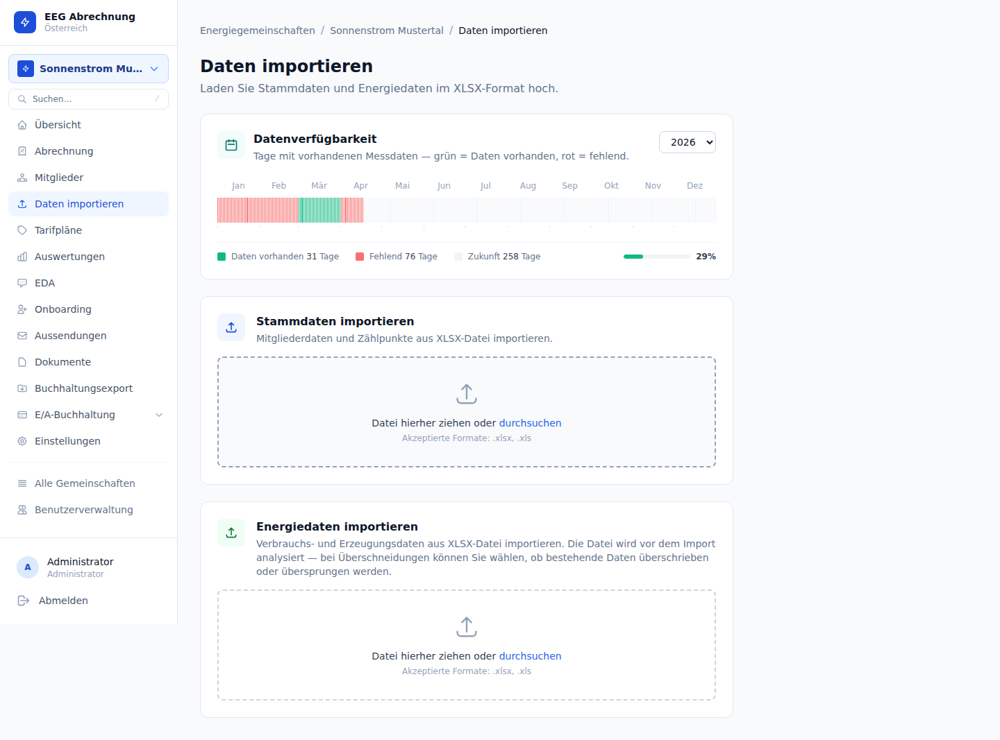

# 5 Energiedaten importieren

Energiedaten bilden die Grundlage jeder Abrechnung. Das System unterstützt zwei Quellen: den manuellen XLSX-Import und den automatisierten EDA-Empfang durch den EDA-Worker.



---

## 5.1 Datenquellen

| Quelle (`source`) | Herkunft | Verfügbar seit |
|-------------------|---------|---------------|
| `xlsx` | Manueller Upload durch den Administrator | Migration 016 |
| `eda` | Automatisch vom EDA-Worker (E-Mail / Ponton) | Migration 016 |

Beide Quellen schreiben in dieselbe Tabelle `energy_readings`. Das Feld `source` ermöglicht es, die Herkunft eines Messwertes nachzuverfolgen und verhindert Doppelimporte (Deduplizierung über `message_id` bei EDA-Nachrichten).

---

## 5.2 XLSX-Import

### Import starten

Die Importseite ist unter `/eegs/{eegId}/import` erreichbar. Sie enthält zwei separate Upload-Bereiche:

1. **Stammdaten importieren** — Mitglieder und Zählpunkte aus XLSX (Massenanlage)
2. **Energiedaten importieren** — Verbrauchs- und Erzeugungswerte aus XLSX

Beide Bereiche unterstützen Drag & Drop sowie die klassische Dateiauswahl (`.xlsx`, `.xls`).

### Import-Workflow Energiedaten

```
1. XLSX-Datei auswählen oder per Drag & Drop hochladen
2. System analysiert die Datei (Preview-Endpoint)
3. Erkannte Zeilen werden mit Zählpunkt, Zeitraum und kWh-Wert angezeigt
4. Überlappungsprüfung: Bereits vorhandene Readings für denselben Zeitraum werden markiert
5. Administrator wählt Strategie bei Überlappungen:
      Overwrite  — vorhandene Daten werden überschrieben
      Skip       — bereits vorhandene Zeilen werden übersprungen
      Cancel     — Import wird vollständig abgebrochen
6. Bestätigung → Daten werden gespeichert
7. Datenverfügbarkeits-Timeline aktualisiert sich automatisch
```

### Erwartetes XLSX-Format

Das System erwartet das Format, wie es von **Wiener Netze** und **OeMAG** exportiert wird. Jede Zeile enthält einen 15-Minuten-Messwert mit folgenden Spalten:

| Spalte | Inhalt | Hinweis |
|--------|--------|---------|
| Zählpunktnummer | 33-stellige AT-Nummer | Muss im System angelegt sein |
| Datum / Uhrzeit | ISO-8601 oder österreichisches Datumsformat | 15-Minuten-Raster |
| Energiewert | Numerisch | Angabe in **kWh** (historisch als „Wh" bezeichnet — niemals durch 1000 teilen) |
| Qualitätsstufe | L0 / L1 / L2 / L3 | Bestimmt ob der Wert abgerechnet wird |

<div class="warning">
Zählpunktnummern im XLSX, die im System nicht angelegt sind, werden stillschweigend übersprungen. Vor dem Import sicherstellen, dass alle relevanten Zählpunkte unter <em>Mitglieder → Zählpunkte</em> vorhanden sind.
</div>

---

## 5.3 Qualitätsstufen

Seit Datenbankmigration 018 speichert jede Messwertreihe eine Qualitätsstufe (`quality`). Die Stufe entscheidet, ob ein Messwert in die Abrechnung einfließt.

| Stufe | Bedeutung | Abrechnung |
|-------|-----------|------------|
| `L0` | Schätzmessung | Ja |
| `L1` | Ersatzwert (interpoliert) | Ja |
| `L2` | Messwert (Zählerstand) | Ja |
| `L3` | Hochqualitativer Messwert (Stufe 3) | **Nein** |

<div class="warning">
L3-Werte werden von der Abrechnung <strong>ausgeschlossen</strong>. Das entspricht der österreichischen Regulatorik: L3-Werte stehen erst nach abgeschlossener Plausibilisierung zur Verfügung und ersetzen nachträglich die L0/L1/L2-Werte. Das System rechnet grundsätzlich mit den in der Messperiode verfügbaren L0–L2-Werten ab und schließt L3 explizit aus.
</div>

---

## 5.4 Datenverfügbarkeits-Timeline

Die Timeline am oberen Rand der Importseite zeigt für jeden Tag, ob Energiedaten vorhanden sind.

- **Grün**: Mindestens ein Messwert für diesen Tag vorhanden
- **Grau / leer**: Keine Daten für diesen Tag
- Tage vor dem **Gründungsdatum** der EEG werden nicht als fehlend gewertet
- Die Timeline aktualisiert sich automatisch nach jedem abgeschlossenen Import
- Nach dem Import scrollt die Seite automatisch zur Timeline, um die neu importierten Tage anzuzeigen

Die Timeline ist das primäre Werkzeug, um **Datenlücken** vor einem Abrechnungslauf zu identifizieren. Fehlende Daten für abzurechnende Perioden führen zu unvollständigen oder fehlerhaften Rechnungen.

---

## 5.5 Energieeinheiten-Konvention

<div class="warning">
<strong>Wichtig:</strong> Alle Energiewerte im System sind in <strong>kWh</strong> gespeichert und übertragen — obwohl Datenbankspaltennamen und interne Feldbezeichnungen das Präfix <code>wh_</code> tragen (z.B. <code>wh_total</code>, <code>wh_self</code>, <code>wh_community</code>). Dieses Präfix ist ein historisches Artefakt aus der Entstehungsgeschichte des Systems.
</div>

Die Konsequenz: Werte aus der Datenbank oder der API **dürfen niemals durch 1000 dividiert werden**, um kWh zu erhalten — sie sind bereits in kWh.

Die Anzeigelogik im Frontend folgt dieser Konvention:

```
Wert < 100 000 kWh  →  Anzeige in kWh (z.B. „1 234,56 kWh")
Wert ≥ 100 000 kWh  →  Anzeige in MWh (z.B. „123,46 MWh")
```

Die Referenzimplementierung befindet sich in `web/components/energy-charts.tsx` (Funktion `fmtKwh()`).

---

## 5.6 Stammdaten-Import (XLSX)

Neben Energiedaten kann auch eine Stammdaten-XLSX hochgeladen werden, um Mitglieder und Zählpunkte in einem Schritt anzulegen. Dieses Format entspricht der Exportstruktur des Systems und ist für die initiale Befüllung bei Inbetriebnahme oder Migration gedacht.

<div class="tip">
Für laufende Änderungen an Mitgliedern und Zählpunkten — etwa Adressänderungen oder Statuswechsel — die Einzelbearbeitung über die Mitgliederverwaltung bevorzugen. Der Stammdaten-Import ist primär für die Massenersterfassung ausgelegt.
</div>
