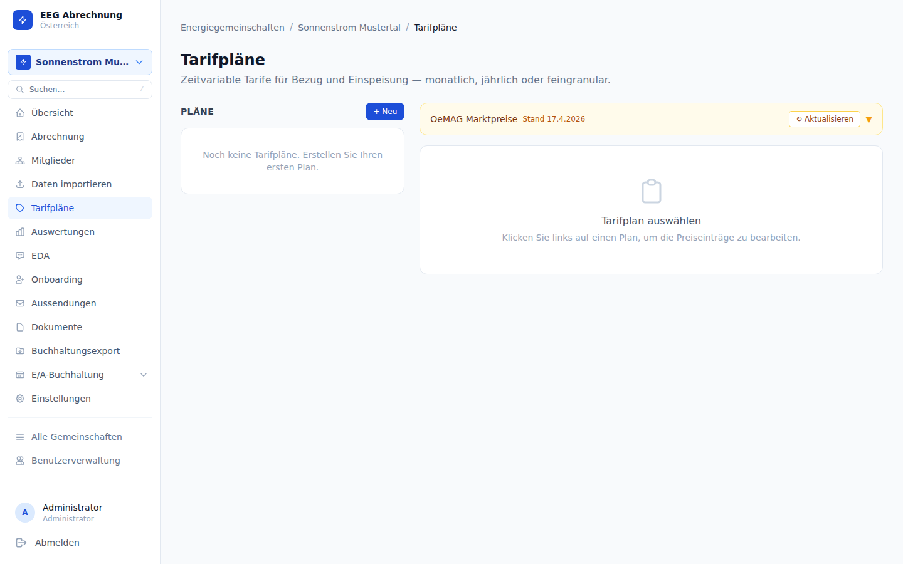

# Tarifpläne



---

## Konzept

Preise werden **ausschließlich in Tarifplänen** (Tariff Schedules) definiert. Die EEG-Einstellungsseite enthält keine Arbeitspreis- oder Einspeisetarif-Felder mehr — alle Preiskonfiguration erfolgt über diese Seite.

Pro EEG kann zu jedem Zeitpunkt **genau ein aktiver Tarifplan** existieren. Diese Eindeutigkeit wird durch einen partiellen Unique-Index in der Datenbank erzwungen (Migration 013).

**Datenbankstruktur:**

| Tabelle | Inhalt |
|---------|--------|
| `tariff_schedules` | Plan-Header: Name, EEG-Referenz, Gültigkeitszeitraum |
| `tariff_entries` | Einzeleinträge: Granularität, Zeitraum, Arbeits- und Einspeisetarif |

---

## Tarifplan anlegen

Über die Schaltfläche **Neuer Tarifplan** öffnet sich ein Formular mit folgenden Feldern:

| Feld | Beschreibung |
|------|-------------|
| **Name** | Frei wählbare Bezeichnung (z. B. „Tarif 2025") |
| **Gültig von** | Startdatum des Plans |
| **Gültig bis** | Enddatum (leer = unbegrenzt) |
| **Granularität** | Zeitliche Auflösung der Einträge (siehe unten) |

### Granularitäten

| Granularität | Typischer Einsatz |
|-------------|------------------|
| **Jährlich** | Einfacher Festtarif für das gesamte Jahr |
| **Monatlich** | Saisonale Preisunterschiede (Sommer/Winter) |
| **Täglich** | Wochentag- oder Feiertagstarife |
| **15-Minuten** | Dynamische Tarife nach Spotmarkt-Logik |

### Tarifeinträge

Innerhalb eines Plans wird jeder Eintrag konfiguriert mit:

- **Zeitraum** (von/bis, passend zur gewählten Granularität)
- **Arbeitspreis** (ct/kWh) — Preis, den Consumer pro bezogener kWh zahlen
- **Einspeisetarif** (ct/kWh) — Vergütung, die Producer pro eingespeister kWh erhalten

<div class="tip">
Mehrere Einträge können sich zeitlich überschneiden. Die Abrechnungslogik mittelt die Preise gewichtet nach der Überschneidungsdauer (siehe Abschnitt „Abrechnungslogik").
</div>

---

## Abrechnungslogik

Bei der Erstellung eines Abrechnungslaufs werden die relevanten Tarifeinträge wie folgt ermittelt:

1. **Aktiven Tarifplan laden**, dessen Gültigkeitszeitraum den Abrechnungszeitraum überschneidet.
2. **Einträge filtern**, die in den Abrechnungszeitraum fallen.
3. **Weighted Blend berechnen**: Überschneidende Einträge werden nach ihrer Überschneidungsdauer mit dem Abrechnungszeitraum gewichtet gemittelt.
4. **Fallback**: Zeiträume, die von keinem Eintrag abgedeckt werden, fallen auf die DB-Felder `eeg.energy_price` (Arbeitspreis) und `eeg.producer_price` (Einspeisetarif) zurück. Diese Felder sind im UI nicht sichtbar und dienen nur als Sicherheitsnetz.

### Beispiel: Weighted Blend

Ein Abrechnungslauf läuft über den **gesamten Januar** (31 Tage).

| Plan | Zeitraum | Arbeitspreis | Überschneidung |
|------|----------|-------------|----------------|
| Plan A | 1. Jan – 31. Jan | 10,00 ct/kWh | 23 Tage (1.–23. Jan) |
| Plan B | 21. Jan – 31. Jan | 12,00 ct/kWh | 8 Tage (21.–28. Jan) |

> Annahme: Plan B beginnt am 21. Jan und endet am 28. Jan; Plan A deckt den Rest des Monats ab.

Effektiver Arbeitspreis für diesen Abrechnungslauf:

```
Effektiver Preis = (23/31 × 10,00) + (8/31 × 12,00)
                = 7,42 + 3,10
                = 10,52 ct/kWh
```

<div class="tip">
Je feiner die Granularität, desto präziser ist die Gewichtung. Bei 15-Minuten-Einträgen wird jede Viertelstunde einzeln bewertet.
</div>

---

## Überschneidungsschutz

Das System erlaubt nur **einen aktiven Plan pro EEG** zur gleichen Zeit. Beim Anlegen eines neuen Plans wird geprüft, ob der Gültigkeitszeitraum mit einem bestehenden aktiven Plan überlappt. Bei Konflikt wird ein Fehler zurückgegeben — der bestehende Plan muss zuerst beendet oder deaktiviert werden.

<div class="warning">
Wird ein Tarifplan gelöscht, der bereits für abgeschlossene Abrechnungsläufe verwendet wurde, gehen die historischen Preisinformationen nicht verloren — Rechnungen speichern die angewandten Preise zum Zeitpunkt der Abrechnung direkt in der `invoices`-Tabelle (`net_amount`, `vat_amount`, `vat_pct_applied`).
</div>

---

## Fallback-Preise

Falls kein Tarifplan für einen Zeitraum vorhanden ist, greift das System automatisch auf die direkt in der EEG-Konfiguration gespeicherten Felder zurück:

| DB-Feld | Bedeutung |
|---------|-----------|
| `eeg.energy_price` | Arbeitspreis für Consumer (ct/kWh) |
| `eeg.producer_price` | Einspeisetarif für Producer (ct/kWh) |

<div class="warning">
Diese Felder sind im UI nicht zugänglich. Sie können nur direkt über die Datenbank oder die API gesetzt werden und sollten nur als Notfall-Fallback dienen. Es wird empfohlen, stets mindestens einen aktiven Tarifplan zu pflegen.
</div>
