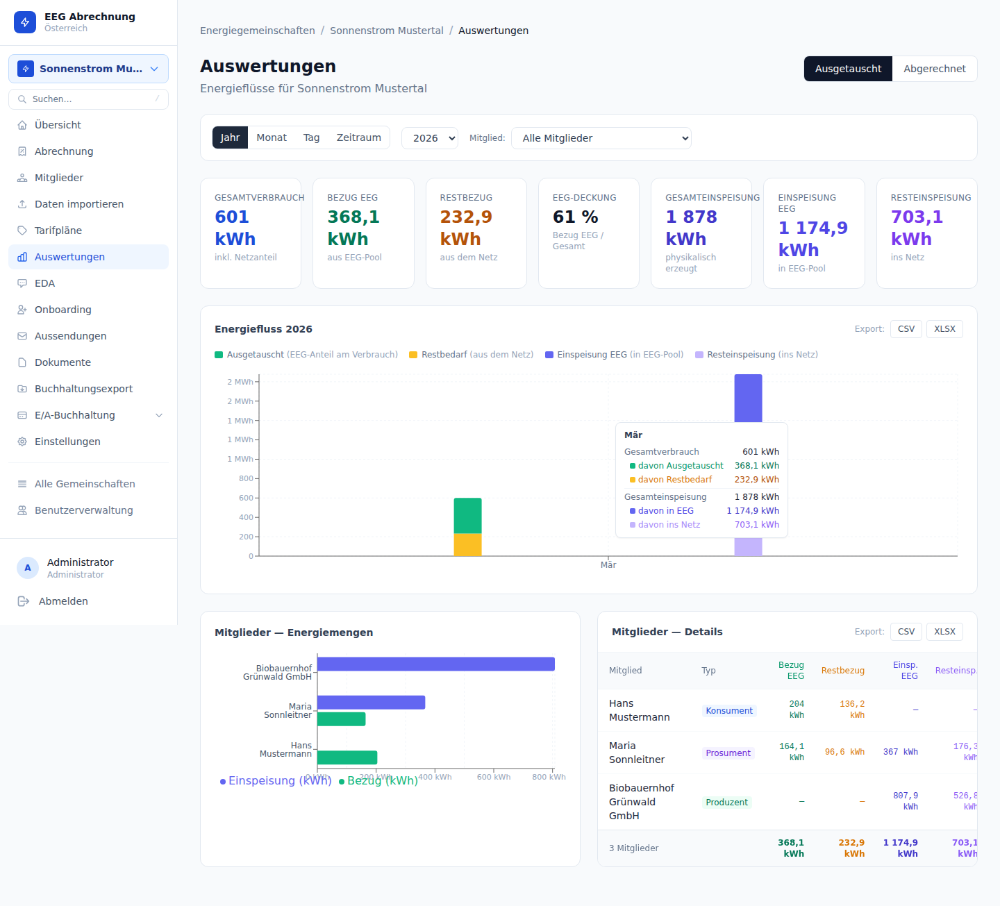

# Berichte & Energieanalyse

---

## Übersicht

Die Berichtsseite unter `/eegs/{eegId}/reports` bietet eine interaktive Auswertung aller Energiedaten der EEG. Administratoren können Verbrauch, Einspeisung, Eigenverbrauch und Gemeinschaftsanteil auf verschiedenen Zeitebenen analysieren und als CSV oder XLSX exportieren.

---

## Granularitäten

| Granularität | Typischer Betrachtungszeitraum | Anwendungsfall |
|-------------|-------------------------------|----------------|
| **Jahresansicht** | Mehrere Kalenderjahre | Langzeittrend, Wachstum der EEG |
| **Monatsansicht** | 1 Kalenderjahr | Saisonales Muster, Sommer-/Wintervergleich |
| **Tagesansicht** | 1 Kalendermonat | Tagesverlauf, Produktionsspitzen |
| **15-Minuten** | 1 Tag | Spitzenlast-Analyse, Lastprofil |

Die Granularität wird über die Navigationsleiste der Berichtsseite ausgewählt. Der angezeigte Zeitraum passt sich automatisch an die gewählte Granularität an.

---

## Mitglieder-Aufschlüsselung

Unterhalb des Gesamtdiagramms steht eine tabellarische Aufschlüsselung pro Mitglied zur Verfügung:

- **Verbrauch** (Consumption) — aus dem Netz bezogene Energie
- **Einspeisung** (Generation) — ins Netz eingespeiste Energie
- **Eigenverbrauch** — direkt vor Ort verbrauchte Produktion
- **Gemeinschaftsanteil** — dem Mitglied zugewiesene EEG-Gemeinschaftsenergie

Das Balkendiagramm zeigt Gesamt- und Einzelwerte nebeneinander. Consumer-Mitglieder erscheinen mit Verbrauchsbalken, Prosumer-/Producer-Mitglieder zusätzlich mit Einspeisebalken.

---

## Energiewerte: kWh und MWh

Alle Energiewerte in der Datenbank sind in **kWh** gespeichert — trotz historischer Spaltennamen mit dem Präfix `wh_` (z. B. `wh_total`, `wh_self`, `wh_community`). Diese Benennung ist ein historisches Artefakt. Die Werte dürfen **nicht** durch 1000 geteilt werden.

Die Anzeige wechselt automatisch zwischen kWh und MWh:

| Schwellwert | Anzeige |
|-------------|---------|
| < 100.000 | kWh (z. B. „42.318 kWh") |
| ≥ 100.000 | MWh (z. B. „142,3 MWh") |

Dieses Verhalten ist in der Hilfsfunktion `fmtKwh()` in `web/components/energy-charts.tsx` implementiert und wird konsistent auf allen Diagrammen und Tabellen der Anwendung angewendet.

---

## Energie-Felder Referenz

| DB-Feld | Bedeutung | Einheit |
|---------|-----------|---------|
| `wh_total` | Gesamtenergie des Zählpunkts | kWh |
| `wh_self` | Eigenverbrauch (lokal gedeckt) | kWh |
| `wh_community` | Gemeinschaftsenergie (EEG-Anteil) | kWh |

---

## Datenqualität

Energiemesswerte tragen ein Qualitätsmerkmal (`quality`-Spalte auf `energy_readings`, seit Migration 018):

| Qualitätsstufe | Bedeutung | In Abrechnung |
|---------------|-----------|--------------|
| `L0` | Rohwert / ungeprüft | Ja |
| `L1` | Geprüft | Ja |
| `L2` | Validiert | Ja |
| `L3` | Ersatzwert / Schätzung | **Nein** |

L3-Werte werden in der Abrechnung automatisch ausgeschlossen, erscheinen aber in den Berichten als separate Kennzeichnung, damit Lücken im Datensatz erkennbar bleiben.

---

## Export

Nach Auswahl des gewünschten Zeitraums und der Granularität können die angezeigten Daten exportiert werden:

| Format | Inhalt |
|--------|--------|
| **CSV** | Rohe Zahlenwerte mit Timestamp, Mitglied und Zählpunkt; geeignet für Weiterverarbeitung in externen Tools |
| **XLSX** | Formatiertes Excel-Dokument mit Summenzeilen und Spaltenüberschriften; geeignet für Berichte an Mitglieder oder Behörden |

Beide Exporte enthalten alle in der aktuellen Ansicht gefilterten Zeiträume und Mitglieder.

---

## Datenverfügbarkeit prüfen

Auf der **Import-Seite** (`/eegs/{eegId}/import`) steht ein Abdeckungs-Timeline-Diagramm bereit, das pro Tag anzeigt, ob Messwerte vorhanden sind. Dieses Diagramm aktualisiert sich automatisch nach einem Import.

Fehlende Messwerte (Lücken im Timeline-Diagramm) führen zu unvollständigen Abrechnungen. Vor jedem Abrechnungslauf sollte die Datenabdeckung für den gewünschten Zeitraum geprüft werden.

