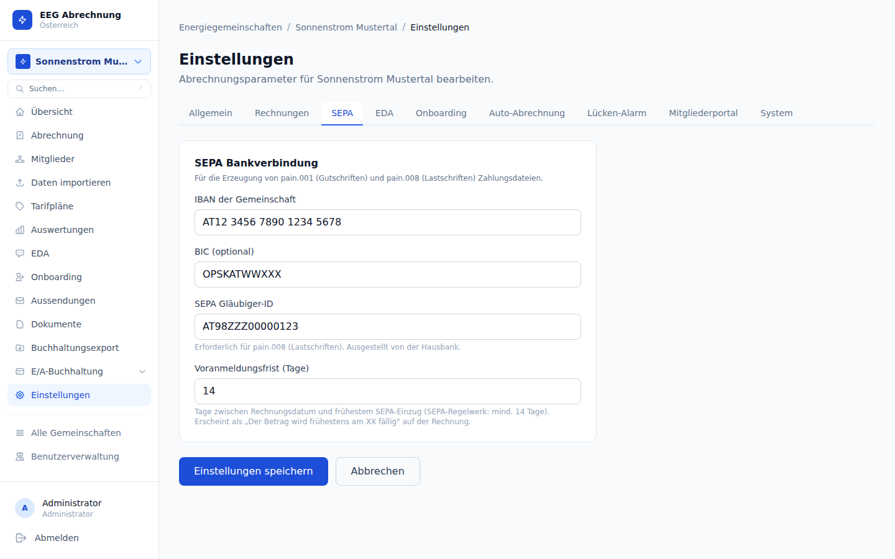

# SEPA-Dateien

Nach Finalisierung eines Abrechnungslaufs können SEPA-Zahlungsdateien erzeugt werden — für die automatisierte Abwicklung von Überweisungen an Produzenten und Lastschriften von Verbrauchern.

---

## SEPA-Konfiguration

Die SEPA-Stammdaten der EEG werden in den **EEG-Einstellungen → Tab SEPA** hinterlegt.

| Feld | Beschreibung |
|------|-------------|
| IBAN | IBAN des EEG-Bankkontos |
| BIC | BIC/SWIFT-Code der kontoführenden Bank |
| SEPA-Gläubiger-ID | Creditor Identifier (Pflicht für Lastschriften, von der Bank vergeben) |

Ohne vollständig hinterlegte SEPA-Stammdaten können keine SEPA-Dateien erzeugt werden. Die Gläubiger-ID ist insbesondere für pain.008-Lastschriften zwingend erforderlich.

---

## Zwei SEPA-Dateitypen

### pain.001 — Überweisungen (Credit Transfer)

- **Verwendungszweck:** EEG überweist Einspeisevergütung an Produzenten
- **Grundlage:** Finalisierte Dokumente mit `document_type = credit_note` (Gutschriften)
- **Richtung:** EEG-Konto → Produzenten-Konto

### pain.008 — Lastschriften (Direct Debit)

- **Verwendungszweck:** EEG zieht Verbrauchsgebühren von Consumer-Konten ein
- **Grundlage:** Finalisierte Rechnungen mit `document_type = invoice`
- **Richtung:** Consumer-Konto → EEG-Konto
- **Voraussetzung:** Gültiges SEPA-Mandat (IBAN + BIC am Mitglied hinterlegt)

---

## Voraussetzungen für den SEPA-Export

| Voraussetzung | Wo konfigurieren |
|--------------|-----------------|
| EEG-IBAN + BIC hinterlegt | EEG-Einstellungen → Tab SEPA |
| EEG-Gläubiger-ID hinterlegt | EEG-Einstellungen → Tab SEPA |
| Mitglied-IBAN + BIC hinterlegt | Mitglied-Stammdaten |
| Abrechnungslauf finalisiert | Abrechnungs-Seite → Lauf abschließen |

Mitglieder ohne hinterlegte IBAN/BIC werden beim SEPA-Export automatisch übersprungen. Die erzeugte Datei enthält nur jene Mitglieder, für die vollständige Bankdaten vorliegen.

---

## Ablauf

1. SEPA-Stammdaten der EEG vollständig konfigurieren (einmalig)
2. IBAN und BIC bei allen relevanten Mitgliedern eintragen
3. Abrechnungslauf finalisieren (`Status: finalized`)
4. Auf der Abrechnungsseite die gewünschte SEPA-Datei herunterladen:
   - **pain.001** für Produzenten-Überweisungen
   - **pain.008** für Consumer-Lastschriften
5. Datei bei der Bank einreichen (Online-Banking-Portal oder EBICS)

SEPA-Dateien sind nach dem Herunterladen direkt für den Upload bei der Bank geeignet. Vor dem Einreichen die enthaltenen Beträge und Kontoverbindungen sorgfältig prüfen. Ein fehlerhaft eingereichter Auftrag kann nicht ohne weiteres widerrufen werden.

---

## Hinweise zum SEPA-Mandat

Für pain.008-Lastschriften ist ein gültiges SEPA-Lastschriftmandat des Mitglieds gegenüber der EEG erforderlich. Die Verwaltung der Mandate (Mandatsreferenz, Unterschriftsdatum) erfolgt außerhalb des Systems — die Plattform stellt lediglich die technische SEPA-Datei bereit. Die rechtliche Verpflichtung zur Mandatsverwaltung liegt beim EEG-Betreiber.

---

## SEPA Pre-Notification (Voravis)

Gemäß SEPA-Lastschrift-Rulebook muss der Zahlungspflichtige **mindestens 14 Kalendertage** vor dem Einzugstermin vorinformiert werden. Die Vorlaufzeit ist in den EEG-Einstellungen konfigurierbar (`sepa_pre_notification_days`, Standard 14).

Das Einzugsdatum in der pain.008-Datei wird automatisch auf `Rechnungsdatum + Vorlaufzeit` gesetzt.

Bei sehr kurzen Abrechnungszyklen (z.B. monatlich) sollte die Vorlaufzeit und der geplante Versandtermin aufeinander abgestimmt sein, damit der Einzugstermin in der Zukunft liegt.

---

## SEPA-Rücklastschriften

Wenn eine eingezogene Zahlung vom Kreditinstitut zurückgebucht wird (Rücklastschrift), kann dies im System erfasst werden.

### Manuelle Erfassung

Auf der Rechnungsdetailseite gibt es den Button **„Rücklastschrift erfassen"**. Dabei werden folgende Felder gespeichert:

| Feld | Beschreibung |
|------|-------------|
| Datum | Zeitpunkt der Rücklastschrift |
| Grund | SEPA-Rückgabecode (z.B. `AC01` falsche IBAN, `AM04` kein Guthaben) |
| Notiz | Interne Bemerkung |

Rechnungen mit Rücklastschrift werden in der Rechnungsliste mit einem roten Badge markiert. Im Dashboard erscheint ein Alert wenn offene Rücklastschriften vorliegen.

**Filter:** `GET .../invoices?sepa_returned=true` gibt nur Rechnungen mit Rücklastschrift zurück.

### Automatischer Import (CAMT.054)

Banken liefern Rücklastschrift-Dateien im CAMT.054-Format. Diese können direkt importiert werden:

**Endpunkt:** `POST /api/v1/eegs/{eegId}/sepa/camt054`
**Format:** XML (multipart)

Das System matched Rücklastschriften automatisch per `EndToEndId = InvoiceUUID` (das UUID der Rechnung wird beim pain.008-Export als EndToEndId eingetragen).

### SEPA-Mandat

Das revisionssichere SEPA-Mandat (erfasst beim Onboarding) kann als PDF heruntergeladen werden. Details siehe **[Kapitel 4: Mitglieder](04-mitglieder.md)**.
