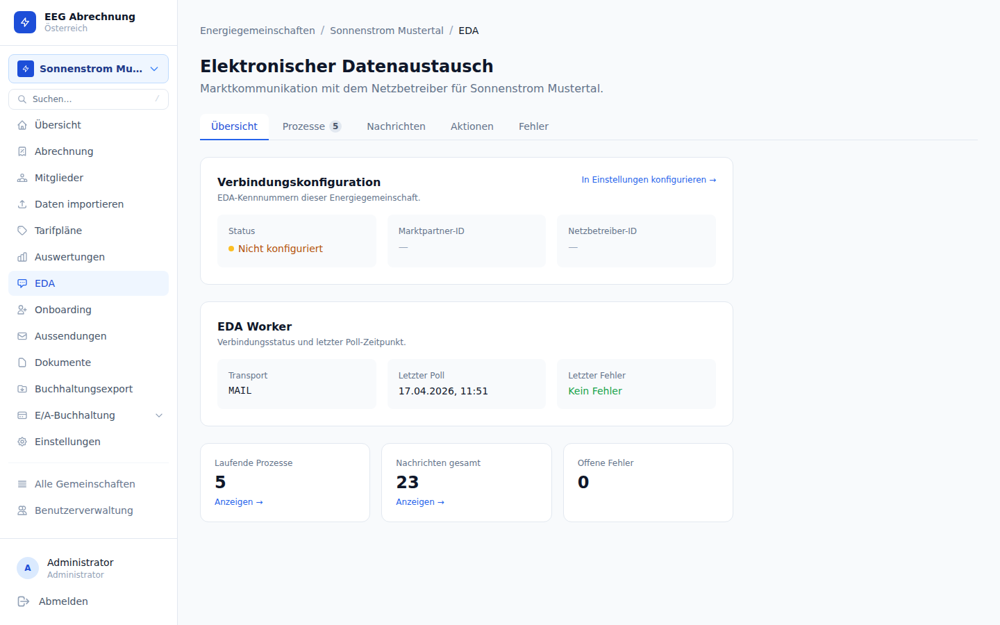

# EDA-Prozesse

EDA (Elektronischer Datenaustausch) ist der standardisierte XML-basierte Nachrichtenaustausch im österreichischen Energiemarkt (MaKo). Über CPRequest- und CPDocument-Nachrichten werden An- und Abmeldungen von Zählpunkten sowie Änderungen des Teilnahmefaktors mit dem zuständigen Netzbetreiber abgewickelt.

**Seite:** `/eegs/{eegId}/eda`


---

## EDA-Seite: Tabs

| Tab | Inhalt |
|-----|--------|
| **Prozesse** | Liste aller EDA-Vorgänge mit aktuellem Status, Zählpunkt, Prozesstyp und Fristen |
| **Nachrichten** | Rohes Nachrichtenprotokoll — alle ein- und ausgehenden XML-Nachrichten |

---

## Prozesstypen

| Typ | Beschreibung | API-Endpunkt |
|-----|-------------|-------------|
| `EC_REQ_ONL` | Anmeldung eines Zählpunkts bei der EEG | `POST /eda/anmeldung` |
| `CM_REV_SP` | Widerruf/Abmeldung eines Zählpunkts | `POST /eda/widerruf` |
| `EC_PRTFACT_CHG` | Änderung des Teilnahmefaktors eines Zählpunkts | `POST /eda/teilnahmefaktor` |
| `EC_REQ_PT` | Datenanforderung (historische Verbrauchsdaten) | `POST /eda/zaehlerstandsgang` |
| `EC_PODLIST` | Zählpunktliste vom Netzbetreiber | intern |

---

## Prozess-Lebenszyklus

```
pending → sent → first_confirmed → confirmed → completed
                                ↘ rejected
                                ↘ error
```

| Status | Bedeutung |
|--------|----------|
| `pending` | Prozess angelegt, noch nicht an Netzbetreiber übermittelt |
| `sent` | CPRequest-XML erfolgreich versendet |
| `first_confirmed` | Erste Bestätigung (technische Eingangsbestätigung) erhalten |
| `confirmed` | Inhaltliche Bestätigung erhalten |
| `completed` | Prozess vollständig abgeschlossen |
| `rejected` | Netzbetreiber hat den Antrag abgelehnt |
| `error` | Technischer Fehler; Nachricht in `eda_errors` Dead-Letter-Table |

<div class="tip">Abgelehnte Prozesse (`rejected`) enthalten in der Regel eine Fehlerbeschreibung des Netzbetreibers, die im Nachrichten-Tab eingesehen werden kann. Häufige Ursachen: falsches Datum, bereits aktive Anmeldung, ungültige Marktpartner-ID.</div>

---

## Widerruf (CM_REV_SP)

Der Widerruf meldet einen Zählpunkt vom EDA-System ab. Er wird ausgelöst durch:
- **Manuell:** Button auf der Zählpunkt-Detailseite (nur wenn `consent_id` gespeichert ist)
- **Automatisch beim Austritt:** `POST .../members/{id}/austritt` triggert CM_REV_SP für alle aktiven Zählpunkte mit consent_id

**Voraussetzung:** Der Zählpunkt muss eine `consent_id` haben (wird vom Netzbetreiber bei erfolgreicher Anmeldung übermittelt).

**Gültigkeitsdatum (`valid_from`):** Muss mindestens morgen und maximal 30 österreichische Arbeitstage in der Zukunft liegen.

**Endpunkt:** `POST /api/v1/eegs/{eegId}/eda/widerruf`
**Body:** `{ "meter_point_id": "...", "valid_from": "YYYY-MM-DD" }`

**Nach Bestätigung (CM_REV_CUS / CM_REV_IMP):** Der Worker setzt automatisch `meter_point.abgemeldet_am` aus dem ECMPList ConsentEnd-Datum.

---

## Automatische Aktionen nach Bestätigung (ABSCHLUSS_ECON)

| Prozesstyp | Bestätigt durch | Automatische Aktion |
|-----------|----------------|---------------------|
| `EC_REQ_ONL` | Netzbetreiber (ECMPList) | `registriert_seit` aus DateFrom setzen; `consent_id` speichern; Bestätigungs-E-Mail an Mitglied; Onboarding-Status aktivieren |
| `CM_REV_SP` | CM_REV_CUS / CM_REV_IMP | `abgemeldet_am` aus ConsentEnd-Datum setzen |

---

## CMRequest Schema-Version

Die EDA-Anmeldung (`EC_REQ_ONL`) verwendet **CMRequest Schema 01.30**, aktiv auf edanet seit 12.04.2026 (entspricht `EC_REQ_ONL_02.30`, `EC_REQ_OFF_02.20`).

<div class="warning">Vor dem 12.04.2026 gibt edanet die Fehlermeldung "No activated XML Schema for MessageType:null Version:null" zurück — das ist kein Bug in der Software, sondern ein Timing-Problem des Schema-Aktivierungsdatums.</div>

---

## EDA-Konfiguration

Die EDA-Stammdaten werden in den **EEG-Einstellungen → Tab EDA** hinterlegt.


| Feld | Beschreibung |
|------|-------------|
| EDA Marktpartner-ID | Eigene Marktpartner-ID der EEG (wird als Absender in CPRequest eingetragen) |
| EDA Netzbetreiber-ID | Marktpartner-ID des zuständigen Netzbetreibers (Empfänger) |
| EDA Übergangs-Datum | Stichtag für Mehrfachteilnahme-Umstellung (§ 16a EAG, April 2024) |

<div class="warning">Die Marktpartner-IDs müssen exakt mit den Stammdaten des Netzbetreibers übereinstimmen. Fehlerhafte IDs führen zu abgelehnten Nachrichten ohne Rückmeldung.</div>

---

## EDA Worker

Der EDA Worker ist ein separates Binary, das unabhängig vom API-Server läuft. Er übernimmt den Poll/Send-Loop: ausgehende EDA-Jobs werden aus der `jobs`-Tabelle abgearbeitet, eingehende Nachrichten werden empfangen und geparst.

**Aktivierung:**
```bash
docker compose --profile eda up
```

### Transport-Modi

| Modus | Aktivierung | Verwendungszweck |
|-------|-------------|-----------------|
| `MAIL` | `EDA_TRANSPORT=MAIL` (Standard) | Produktion — IMAP-Polling + SMTP-Versand |
| `PONTON` | `EDA_TRANSPORT=PONTON` | Vorgesehen für Ponton X/P — noch nicht produktionsreif |
| `FILE` | `EDA_TRANSPORT=FILE` | Lokales Testen — liest/schreibt XML-Dateien |

### FILE Transport (lokales Testen)

```bash
# Worker mit FILE Transport starten
docker compose --profile eda run --rm -e EDA_TRANSPORT=FILE eda-worker

# Eingehende XML ablegen (z.B. CPDocument-Bestätigung):
#   test/eda-inbox/<datei>.xml
# Verarbeitete Dateien werden verschoben nach:
#   test/eda-inbox/processed/
# Ausgehende XML werden geschrieben nach:
#   test/eda-outbox/<timestamp>_<prozess>.xml
```

<div class="tip">Der FILE-Transport eignet sich ideal für die Entwicklung und für Integrationstests mit dem Netzbetreiber. Einfach die vom Netzbetreiber erhaltene CPDocument-XML in das Inbox-Verzeichnis legen — der Worker verarbeitet sie beim nächsten Poll-Intervall.</div>

---

## Worker-Betrieb: Hinweise und Fallstricke

### Worker-Status überwachen

Die Tabelle `eda_worker_status` (Singleton) enthält den Gesundheitszustand des Workers:
- `last_poll_at` — wann der letzte Poll-Zyklus abgeschlossen wurde
- `last_error` — letzter Fehler (null wenn gesund)

### BODY.PEEK[] ist Pflicht

Der Worker fetcht IMAP-Nachrichten mit `BODY.PEEK[]` (Peek=true). Ohne Peek würde IMAP die Nachrichten automatisch als `\Seen` markieren. Falls der Worker danach abstürzt oder ein Timeout auftritt, bevor er die Nachrichten explizit als gelesen markiert hat, gehen diese Nachrichten **dauerhaft verloren** — der nächste Poll findet keine ungelesenen Nachrichten und Prozesse bleiben auf „sent" stecken.

### Test-Worker-Konflikt (FILE-Modus)

<div class="warning">Der Test-Worker (`eegabrechnung-eegabrechnung-eda-worker-test-1`, FILE-Modus) teilt dieselbe PostgreSQL-Datenbank mit dem Produktions-MAIL-Worker. Beide benutzen `FOR UPDATE SKIP LOCKED` — wer zuerst pollt, bekommt den Job. Symptom: Prozesse als "sent" markiert, leeres Subject, kein SMTP-Versand, keine edanet-Antwort. **Test-Worker immer stoppen bevor der MAIL-Worker gestartet wird:**

```bash
docker stop eegabrechnung-eegabrechnung-eda-worker-test-1
```
</div>

### Anmeldung valid_from Regeln

EC_REQ_ONL `valid_from` muss **mindestens morgen und maximal 30 Tage in der Zukunft** liegen (serverseitig validiert). Das Onboarding-Convert klemmt ein gespeichertes `beitritts_datum` automatisch auf diesen Bereich.

---

## Wichtige Quelldateien

| Datei | Funktion |
|-------|---------|
| `api/internal/eda/transport/file.go` | FILE-Transport-Implementierung |
| `api/internal/eda/transport/mail.go` | MAIL-Transport (IMAP-Polling + SMTP-Versand) |
| `api/internal/eda/xml/cmrequest_builder.go` | Aufbau der ausgehenden CMRequest-XML (EC_REQ_ONL) |
| `api/internal/eda/xml/cprequest_builder.go` | Aufbau der ausgehenden CPRequest-XML (EC_REQ_PT, EC_PODLIST) |
| `api/internal/eda/xml/ecmplist_builder.go` | Aufbau der ausgehenden ECMPList-XML (EC_PRTFACT_CHG) |
| `api/internal/eda/xml/cmrevoke_builder.go` | Aufbau der ausgehenden CMRevoke-XML (CM_REV_SP) |
| `api/internal/eda/xml/cpdocument_parser.go` | Parsing eingehender CPDocument-Bestätigungen |
| `api/internal/handler/eda.go` | HTTP-Handler für Anmeldung/Widerruf/Teilnahmefaktor |
| `api/internal/repository/eda_process.go` | Prozess-CRUD und Lifecycle-Queries |
| `api/internal/repository/job.go` | `EnqueueEDA` — schreibt Job in `jobs`-Tabelle |
| `api/internal/eda/worker.go` | Poll/Send-Loop des Workers |

---

## Fehlerbehandlung: eda_errors Dead-Letter-Table

Nachrichten, die nicht verarbeitet werden können (Parse-Fehler, unbekannter Prozess, Datenbankfehler), werden in die Tabelle `eda_errors` geschrieben (seit Migration 016). Dadurch gehen keine Nachrichten verloren.

| Spalte | Inhalt |
|--------|--------|
| `raw_message` | Originale XML-Nachricht |
| `error` | Fehlerbeschreibung |
| `created_at` | Zeitpunkt des Fehlers |

Zusätzlich pflegt `eda_worker_status` (Singleton-Tabelle) den Timestamp des letzten Worker-Laufs — nützlich zur Überwachung, ob der Worker aktiv ist.

<div class="danger">Die `eda_errors`-Tabelle sollte regelmäßig geprüft werden, insbesondere nach dem erstmaligen Betrieb mit einem neuen Netzbetreiber. Einträge dort weisen auf strukturelle Probleme hin, die manuellen Eingriff erfordern können.</div>

---

## Nachrichtenprotokoll



Der Tab **Nachrichten** zeigt das vollständige Rohprotokoll aller EDA-Nachrichten:

| Spalte | Inhalt |
|--------|--------|
| Typ | Nachrichtentyp (z.B. `CPRequest`, `CPDocument`, `CMNotification`) |
| Betreff | Subject der Nachricht |
| Body | XML-Inhalt (einklappbar) |
| Status | Verarbeitungsstatus |
| Zeitstempel | Empfangs- bzw. Sendezeitpunkt |

**Technische Eigenschaften:**
- Deduplizierung über `message_id` — doppelt empfangene Nachrichten werden nicht mehrfach verarbeitet
- Scope: Gefiltert pro EEG über die konfigurierte `eda_marktpartner_id`
- Alle Nachrichten bleiben dauerhaft im Protokoll erhalten (kein automatisches Löschen)
