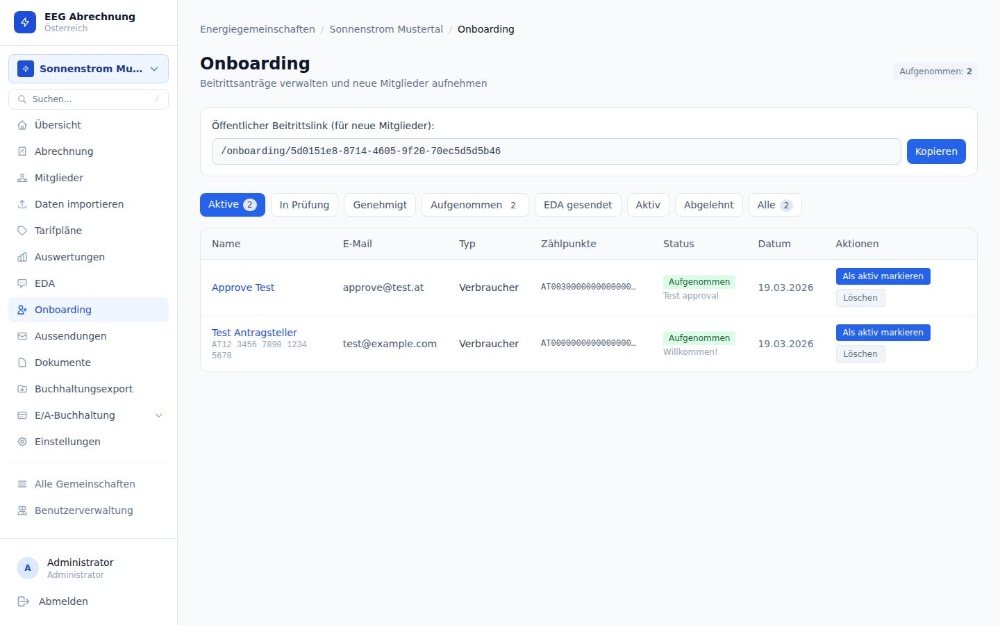

# Onboarding-Portal (Selbstregistrierung)

Das Onboarding-Portal erlaubt neuen Mitgliedern, sich selbst über ein öffentliches Webformular zu bewerben. Der EEG-Administrator prüft den Antrag und genehmigt oder lehnt ihn ab. Bei Genehmigung werden Mitglied, Zählpunkte und EDA-Anmeldung automatisch angelegt.

---

## Öffentliches Registrierungsformular


- **URL**: `/onboarding/{eegId}` — öffentlich zugänglich, kein Login erforderlich
- **Felder**: Vorname, Nachname, E-Mail-Adresse, Adresse (Straße, PLZ, Ort), Beitrittsdatum

Nach dem Absenden erhält der Antragsteller eine Verifikations-E-Mail. Erst nach Bestätigung des Magic Tokens wird der Antrag für den Admin sichtbar.

### E-Mail-Verifikation

Bevor der Antrag vollständig eingereicht werden kann, muss die E-Mail-Adresse verifiziert werden:

1. Bewerber gibt E-Mail-Adresse ein und klickt „Verifizierungslink senden"
2. System sendet Magic-Link an die angegebene E-Mail
3. Bewerber klickt den Link — E-Mail gilt als verifiziert
4. Erst dann kann das Formular vollständig ausgefüllt und abgeschickt werden

Die Verifikations-Token werden in der Tabelle `onboarding_email_verifications` gespeichert (7 Tage Gültigkeit).

### SEPA-Lastschrift-Berechtigung

Im Onboarding-Formular kann optional eine **SEPA-Lastschrift-Berechtigung** erteilt werden. Wenn der Bewerber zustimmt, werden folgende Daten gespeichert:
- `sepa_mandate_signed_at` — Zeitstempel der Zustimmung
- `sepa_mandate_ip` — IP-Adresse des Bewerbers
- `sepa_mandate_text` — vollständiger Mandatstext zum Zeitpunkt der Unterzeichnung

Diese Daten werden bei der Genehmigung auf das Mitglied übertragen. Das Mandat kann anschließend als PDF abgerufen werden (siehe Kapitel 4).

### Firmenmitglieder

Das Onboarding-Formular unterstützt auch Firmenmitglieder. Für Unternehmen werden zusätzliche Felder erfasst:

| Feld | Beschreibung |
|------|-------------|
| `business_role` | Unternehmensrolle / Funktion |
| `uid_nummer` | UID-Nummer (Umsatzsteuer-Identifikationsnummer) |
| `use_vat` | Ob das Unternehmen USt-pflichtig ist |

Diese Felder werden bei der Genehmigung auf das Mitglied übertragen und beeinflussen die Rechnungsstellung (Reverse Charge bei UID-nummernpflichtigen Mitgliedern).

---

## Magic-Token-Flow

```
1. Antragsteller füllt Formular aus
        ↓
   POST /api/v1/public/eegs/{eegId}/onboarding
        ↓
2. System speichert Antrag (Status: pending) und sendet Verifikations-E-Mail
        ↓
3. Antragsteller klickt Link in E-Mail
   GET /onboarding/status?token={magic_token}
        ↓
4. Token wird validiert → Antrag als "verifiziert" markiert
        ↓
5. Admin sieht Antrag in der Verwaltungsansicht
        ↓
6a. Genehmigung: POST /api/v1/eegs/{eegId}/onboarding/{id}/convert
    → atomare Erstellung: Mitglied + Zählpunkte + EDA Anmeldung
6b. Ablehnung: DELETE /api/v1/eegs/{eegId}/onboarding/{id}
```

---

## Admin-Verwaltungsansicht



**URL**: `/eegs/{eegId}/onboarding`

Die Seite zeigt alle eingegangenen Anträge mit ihrem aktuellen Status.

### Statusübergänge

| Status | Bedeutung |
|--------|-----------|
| `pending` | Antrag eingegangen, E-Mail-Verifizierung ausstehend |
| `approved` | Genehmigt, Konvertierung noch nicht abgeschlossen |
| `converted` | Mitglied erfolgreich angelegt |
| `rejected` | Antrag abgelehnt |

### Aktionen

| Aktion | Endpunkt | Effekt |
|--------|----------|--------|
| Genehmigen & Konvertieren | `POST /api/v1/eegs/{eegId}/onboarding/{id}/convert` | Legt Mitglied, Zählpunkte und EDA Anmeldung (EC_EINZEL_ANM) an |
| Ablehnen | `DELETE /api/v1/eegs/{eegId}/onboarding/{id}` | Markiert Antrag als `rejected` und löscht ihn |

<div class="tip">Die Konvertierung ist atomar: Schlägt eines der Teilschritte fehl (z.B. EDA-Anmeldung), wird die gesamte Transaktion zurückgerollt. Der Antrag bleibt dann im Status <code>pending</code> und kann erneut konvertiert werden.</div>

### Automatische Erinnerung

Wenn ein Onboarding-Antrag 72 Stunden nach Einreichung noch nicht bearbeitet wurde, sendet das System automatisch eine **Erinnerungs-E-Mail** an den EEG-Administrator. Das Versanddatum wird in `reminder_sent_at` gespeichert (verhindert Duplikate).

---

## Registrierungslink teilen

Den öffentlichen Link finden und kopieren Sie unter **EEG-Einstellungen → Tab Onboarding**. Das Format ist:

```
{BASE_URL}/onboarding/{eegId}
```

Dieser Link kann auf der Website der EEG, per E-Mail oder in sozialen Medien geteilt werden.

---

## API-Endpunkte

| Methode | Pfad | Auth | Beschreibung |
|---------|------|------|--------------|
| `POST` | `/api/v1/public/eegs/{eegId}/onboarding` | — | Antrag einreichen (öffentlich) |
| `GET` | `/api/v1/eegs/{eegId}/onboarding` | Bearer | Alle Anträge auflisten (Admin) |
| `POST` | `/api/v1/eegs/{eegId}/onboarding/{id}/convert` | Bearer | Genehmigen & Mitglied anlegen |
| `DELETE` | `/api/v1/eegs/{eegId}/onboarding/{id}` | Bearer | Antrag ablehnen / löschen |

---

## Datenbankschema

**Tabelle**: `onboarding_requests` (Migrationen 022, 024, 031, 034, 045, 046)

| Spalte | Typ | Beschreibung |
|--------|-----|--------------|
| `id` | UUID | Primärschlüssel |
| `eeg_id` | UUID | Zugehörige EEG |
| `vorname` | text | Vorname des Antragstellers |
| `nachname` | text | Nachname des Antragstellers |
| `email` | text | E-Mail-Adresse |
| `strasse` | text | Straße und Hausnummer |
| `plz` | text | Postleitzahl |
| `ort` | text | Ort |
| `magic_token` | text | Einmaliger Verifikationstoken |
| `status` | text | `pending` / `approved` / `converted` / `rejected` |
| `beitritts_datum` | date | Gewünschtes Beitrittsdatum |
| `created_at` | timestamptz | Zeitpunkt der Einreichung |
| `business_role` | text | Unternehmensrolle (Migration 045) |
| `uid_nummer` | text | UID-Nummer des Unternehmens (Migration 045) |
| `use_vat` | bool | USt-Pflicht des Unternehmens (Migration 045) |
| `reminder_sent_at` | timestamptz | Zeitpunkt der 72h-Erinnerungsmail (Migration 046) |

**Tabelle**: `onboarding_email_verifications` (Migration 034)

Speichert E-Mail-Verifikations-Tokens (7 Tage Gültigkeit) für den Zwei-Schritt-Verifizierungsfluss.

**Relevante Migrationen:**

| Migration | Inhalt |
|-----------|--------|
| 022 | `onboarding_requests` (Basis) |
| 024 | `beitritts_datum` auf `onboarding_requests` |
| 031 | `onboarding_contract_text` auf EEGs |
| 034 | `onboarding_email_verifications` (E-Mail-Verifizierung) |
| 045 | Business-Felder (`business_role`, `uid_nummer`, `use_vat`) auf `onboarding_requests` |
| 046 | `reminder_sent_at` (72h-Erinnerung) |

<div class="warning">Magic Tokens sind einmalig verwendbar. Klickt ein Antragsteller den Link mehrfach, wird der Token beim ersten Klick konsumiert — weitere Aufrufe sind harmlos, da der Antrag bereits verifiziert ist.</div>

---

## Häufige Fehler

<div class="danger">Wird die EEG-ID im öffentlichen Link falsch angegeben oder gehört sie zu einer anderen Organisation, liefert das Formular einen 404-Fehler. Prüfen Sie den Link aus den EEG-Einstellungen, bevor Sie ihn veröffentlichen.</div>

| Problem | Ursache | Lösung |
|---------|---------|--------|
| Antrag erscheint nicht in der Admin-Ansicht | E-Mail noch nicht verifiziert | Antragsteller bittet den Verifikationslink zu klicken |
| Konvertierung schlägt fehl | EDA-Konfiguration unvollständig | EDA-Einstellungen der EEG prüfen (eda_marktpartner_id, eda_netzbetreiber_id) |
| Doppelter Antrag sichtbar | Mehrfaches Einreichen durch Antragsteller | Duplikat manuell ablehnen (`DELETE`) |
