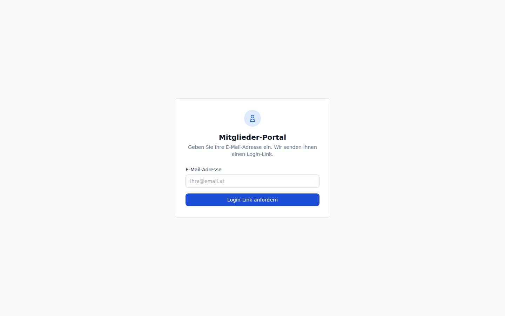

# Mitglieder-Self-Service-Portal

Das Mitgliederportal bietet Mitgliedern der EEG eine passwortlose Self-Service-Oberfläche. Die Authentifizierung erfolgt ausschließlich über einen zeitlich begrenzten Magic Link per E-Mail. Mitglieder können ihre Energiedaten einsehen und Rechnungen als PDF herunterladen — ohne Benutzerkonto und ohne Passwort.

<div class="tip">Das Mitgliederportal ist vollständig von der Admin-Oberfläche getrennt. Mitglieder sehen ausschließlich ihre eigenen Daten.</div>

---

## Magic-Link-Authentifizierung



### Ablauf

```
1. Mitglied öffnet /portal
   Gibt registrierte E-Mail-Adresse ein
        ↓
   POST /api/v1/public/portal/request-link
        ↓
2. System erstellt Session-Token und sendet E-Mail
   mit Link zu /portal/{token}/activate
        ↓
3. Mitglied klickt Link
   GET /api/v1/public/portal/{token}/activate
        ↓
4. Token wird geprüft → HTTP-Only-Session-Cookie wird gesetzt
        ↓
5. Weiterleitung zu /portal/dashboard
```

<div class="warning">Magic Links sind zeitlich begrenzt. Klickt das Mitglied den Link nicht innerhalb der Gültigkeitsdauer, muss ein neuer Link angefordert werden.</div>

### Sicherheitshinweise

- Jeder Token ist **einmalig verwendbar** — nach der Aktivierung wird er ungültig.
- Die Session läuft nach dem konfigurierten `expires_at`-Zeitstempel automatisch ab.
- Es wird **kein Bearer-Token** verwendet — die Authentifizierung basiert auf dem Session-Cookie.
- Mitglieder haben keinen Zugriff auf Verwaltungsfunktionen oder Daten anderer Mitglieder.

---

## Dashboard

**URL**: `/portal/dashboard`

Das Dashboard zeigt dem Mitglied:

| Bereich | Inhalt |
|---------|--------|
| Energieaufschlüsselung | Monatliche Übersicht: Verbrauch, Einspeisung, Eigenverbrauch (in kWh) |
| Rechnungsliste | Alle Rechnungen des Mitglieds mit Betrag, Zeitraum und Status |
| PDF-Download | Einzelne Rechnung als PDF herunterladen |

<div class="tip">Alle Energiewerte werden in kWh angezeigt. Werte über 100.000 kWh werden automatisch als MWh dargestellt.</div>

---

## Anzeige der EEG-Gesamtenergie

Die Einstellung **„Gesamtverbrauch und Reststrom anzeigen"** (`portal_show_full_energy`) in den EEG-Einstellungen (Tab „Mitgliederportal") steuert, ob das Mitglieder-Self-Service-Portal die **gesamte Einspeise- und Bezugsmenge der EEG** oder nur den **persönlichen Mitgliedsanteil** anzeigt.

| Wert | Anzeige im Portal |
|------|-----------------|
| Ein (Standard) | Energie-Dashboard zeigt neben dem EEG-Anteil auch Gesamtbezug, Restbezug, Gesamteinspeisung und Resteinspeisung des Mitglieds |
| Aus | Energie-Dashboard zeigt ausschließlich die über die Energiegemeinschaft verrechneten Anteile des Mitglieds |

<div class="tip">Für Energiegemeinschaften, die Transparenz über die Gesamtproduktion fördern wollen, empfiehlt sich der Standardwert (Ein). Die Einstellung kann jederzeit unter EEG-Einstellungen → Tab „Mitgliederportal" geändert werden.</div>

---

## API-Endpunkte

Die Portal-Endpunkte verwenden **keine Bearer-Authentifizierung**. Die öffentlichen Endpunkte (Präfix `/public/`) erfordern überhaupt keine Authentifizierung; `/portal/me` setzt eine aktive Magic-Link-Session voraus.

| Methode | Pfad | Auth | Beschreibung |
|---------|------|------|--------------|
| `POST` | `/api/v1/public/portal/request-link` | — | Magic Link per E-Mail anfordern |
| `GET` | `/api/v1/public/portal/{token}/activate` | — | Session aus Magic Link aktivieren |
| `GET` | `/api/v1/portal/me` | Magic-Link-Session | Dashboard-Daten abrufen (Energie + Rechnungen) |

### Beispiel: Magic Link anfordern

```bash
curl -X POST https://example.com/api/v1/public/portal/request-link \
  -H "Content-Type: application/json" \
  -d '{"email": "mitglied@beispiel.at"}'
```

Antwort bei Erfolg:

```json
{ "message": "Magic Link wurde per E-Mail versendet." }
```

<div class="tip">Aus Sicherheitsgründen gibt der Endpunkt auch dann eine Erfolgsantwort zurück, wenn die E-Mail-Adresse nicht bekannt ist — so können keine gültigen Adressen durch Enumeration ermittelt werden.</div>

---

## Datenbankschema

**Tabelle**: `member_portal_sessions` (Migration 030)

| Spalte | Typ | Beschreibung |
|--------|-----|--------------|
| `id` | UUID | Primärschlüssel |
| `token` | text | Einmaliger Magic-Link-Token (kryptografisch zufällig) |
| `member_id` | UUID | Zugehöriges Mitglied |
| `expires_at` | timestamptz | Ablaufzeitpunkt der Session |
| `created_at` | timestamptz | Erstellungszeitpunkt |
| `used_at` | timestamptz | Zeitpunkt der Aktivierung (null = noch nicht verwendet) |

---

## Administration

Das Mitgliederportal erfordert **keine gesonderte Konfiguration** durch den Administrator. Voraussetzungen:

1. Das Mitglied muss eine gültige E-Mail-Adresse in den Stammdaten hinterlegt haben.
2. Der SMTP-Dienst muss konfiguriert und erreichbar sein (für den E-Mail-Versand).
3. Die `BASE_URL`-Umgebungsvariable muss korrekt gesetzt sein, damit der Link in der E-Mail auf die richtige Domain zeigt.

<div class="danger">Ist kein SMTP-Dienst konfiguriert, schlägt das Anfordern eines Magic Links lautlos fehl — das Mitglied erhält keine E-Mail. Prüfen Sie die SMTP-Konfiguration im Fehlerfall in den API-Logs.</div>

---

## Häufige Fehler

| Problem | Ursache | Lösung |
|---------|---------|--------|
| „E-Mail nicht gefunden" | E-Mail-Adresse stimmt nicht mit Mitgliedsdaten überein | E-Mail-Adresse in den Mitgliedsstammdaten prüfen |
| Link abgelaufen | Token wurde nicht rechtzeitig verwendet | Neuen Magic Link anfordern |
| Dashboard leer | Keine Energiedaten für den Zeitraum vorhanden | Energiedaten für das Mitglied importieren |
| PDF-Download schlägt fehl | Rechnung noch nicht finalisiert | Abrechnung abschließen (Status: finalized) |
