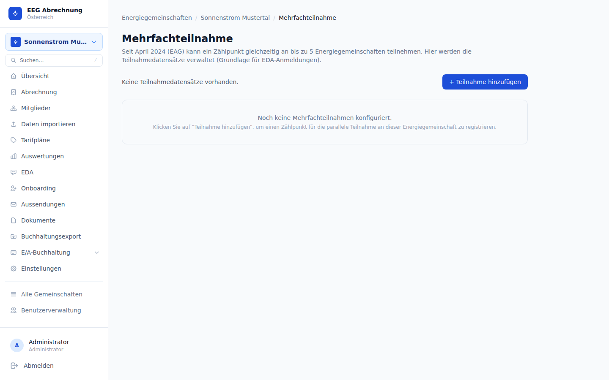

# Mehrfachteilnahme (EAG April 2024)

Seit der EAG-Novelle (Erneuerbaren-Ausbau-Gesetz) April 2024 kann ein Zählpunkt gleichzeitig in mehreren Energiegemeinschaften teilnehmen. Die Plattform bildet diese Mehrfachteilnahmen in der Tabelle `eeg_meter_participations` ab, die gleichzeitig als verbindliche Quelle für EDA-Meldungen an den Netzbetreiber dient.

---

## Verwaltungsseite



**URL**: `/eegs/{eegId}/participations`

Die Seite zeigt alle aktiven und historischen Teilnahmen der Zählpunkte dieser EEG. Neue Teilnahmen können direkt angelegt, bestehende bearbeitet oder gelöscht werden.

---

## Felder einer Teilnahme

| Feld | Typ | Pflicht | Beschreibung |
|------|-----|---------|--------------|
| Zählpunkt | UUID (FK) | ja | Welcher Zählpunkt nimmt teil |
| EEG | UUID (FK) | ja | In welcher Energiegemeinschaft |
| Faktor | decimal (0–1) | ja | Anteil an der Gemeinschaft (z.B. `0.5` = 50 %) |
| Share-Typ | enum | ja | Art der Teilnahme (siehe Tabelle unten) |
| Gültig von | date | ja | Beginn der Teilnahme |
| Gültig bis | date | nein | Ende der Teilnahme — leer = unbefristet |

<div class="tip">Die Summe aller Faktoren eines Zählpunkts über alle aktiven EEGs darf 1,0 nicht überschreiten. Die Plattform prüft dies beim Anlegen und Aktualisieren einer Teilnahme.</div>

---

## Share-Typen

| Kürzel | Vollname | Beschreibung |
|--------|----------|--------------|
| `GC` | Generation Community | Erzeugungs-Energiegemeinschaft (reine Einspeisung) |
| `RC_R` | Renewable Community Resident | Erneuerbare-Energie-Gemeinschaft mit Ansässigkeitserfordernis |
| `RC_L` | Renewable Community Local | Erneuerbare-Energie-Gemeinschaft auf lokaler Netzebene |
| `CC` | Citizen Community | Bürgerenergiegemeinschaft (bundesweit) |

Der Share-Typ bestimmt die rechtliche Einordnung der Teilnahme und wird unverändert in die EDA-Meldung (EC_PRTFACT_CHG) übernommen.

---

## CRUD-Endpunkte

```
GET    /api/v1/eegs/{eegID}/participations          — Alle Teilnahmen auflisten
POST   /api/v1/eegs/{eegID}/participations          — Neue Teilnahme anlegen
PUT    /api/v1/eegs/{eegID}/participations/{id}     — Teilnahme aktualisieren
DELETE /api/v1/eegs/{eegID}/participations/{id}     — Teilnahme löschen
```

Alle Endpunkte erfordern einen gültigen Bearer-Token.

### Beispiel: Teilnahme anlegen

```bash
curl -X POST http://localhost:8101/api/v1/eegs/{eegID}/participations \
  -H "Authorization: Bearer $TOKEN" \
  -H "Content-Type: application/json" \
  -d '{
    "meter_point_id": "...",
    "factor": 0.5,
    "share_type": "RC_R",
    "valid_from": "2024-04-01"
  }'
```

---

## EDA-Verbindung

Jede Änderung an einer Teilnahme (Anlegen, Aktualisieren, Löschen) sollte den entsprechenden EDA-Prozess auslösen:

| Aktion | EDA-Prozesstyp |
|--------|---------------|
| Teilnahme anlegen | `EC_PRTFACT_CHG` (Teilnahmefaktor-Meldung) |
| Faktor oder Datum ändern | `EC_PRTFACT_CHG` |
| Teilnahme löschen / beenden | `EC_PRTFACT_CHG` mit Faktor `0` oder Enddatum |

Den EDA-Prozess können Sie manuell über **EDA → Teilnahmefaktor ändern** auslösen oder über den API-Endpunkt:

```
POST /api/v1/eegs/{eegID}/eda/teilnahmefaktor
```

<div class="warning">Eine Teilnahme in der Datenbank zu löschen, ohne den entsprechenden EC_PRTFACT_CHG-Prozess auszulösen, führt zu einer Inkonsistenz zwischen Plattform und Netzbetreiber. Verwenden Sie stets den EDA-Workflow, um Änderungen zu kommunizieren.</div>

---

## Datenbankschema

**Tabelle**: `eeg_meter_participations` (Migration 021)

| Spalte | Typ | Beschreibung |
|--------|-----|--------------|
| `id` | UUID | Primärschlüssel |
| `eeg_id` | UUID | Zugehörige EEG |
| `meter_point_id` | UUID | Zählpunkt |
| `factor` | numeric | Teilnahmefaktor (0.0–1.0) |
| `share_type` | text | `GC` / `RC_R` / `RC_L` / `CC` |
| `valid_from` | date | Beginn der Teilnahme |
| `valid_until` | date | Ende der Teilnahme (nullable) |
| `created_at` | timestamptz | Erstellungszeitpunkt |
| `updated_at` | timestamptz | Letzter Änderungszeitpunkt |

---

## Zusammenspiel mit der Abrechnung

Beim Abrechnungslauf werden die Teilnahmefaktoren für den abzurechnenden Zeitraum berücksichtigt:

- Ist ein Zählpunkt in mehreren EEGs aktiv, wird die erzeugte oder verbrauchte Energie anteilig nach `factor` zugeordnet.
- Änderungen des Faktors innerhalb des Abrechnungszeitraums werden tagesgenau gewichtet.
- Zählpunkte ohne gültige Teilnahme im Abrechnungszeitraum werden in der Abrechnung nicht berücksichtigt.

<div class="danger">Rückwirkende Änderungen von Teilnahmefaktoren für bereits finalisierte Abrechnungen erfordern eine manuelle Stornierung und Neuabrechnung des betroffenen Zeitraums.</div>

---

## Häufige Fehler

| Problem | Ursache | Lösung |
|---------|---------|--------|
| Faktorsumme > 1.0 | Zählpunkt bereits vollständig in anderer EEG | Faktor der bestehenden Teilnahme reduzieren |
| EDA-Meldung nicht ausgelöst | Teilnahme direkt in DB geändert | EC_PRTFACT_CHG manuell über EDA-Seite auslösen |
| Teilnahme erscheint nicht in Abrechnung | `valid_from` liegt nach Abrechnungsende | Datum der Teilnahme prüfen |
| Zählpunkt nicht auswählbar | Zählpunkt gehört zu anderer Organisation | Organisation und EEG-Zuordnung prüfen |
