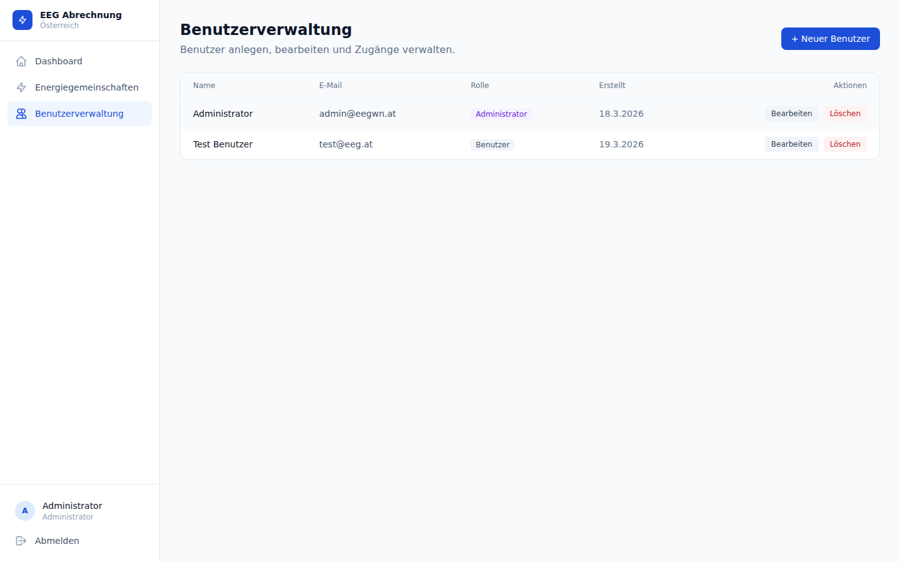

# Benutzerverwaltung



---

## Überblick

Die Benutzerverwaltung ist unter `/admin/users` erreichbar und steht ausschließlich Benutzern mit der Rolle **admin** zur Verfügung. Hier werden Benutzerkonten angelegt, Rollen vergeben und EEG-Zuweisungen gepflegt.

---

## Rollen

| Rolle | Rechte |
|-------|--------|
| `admin` | Vollzugriff auf alle Funktionen, Benutzerverwaltung, alle EEGs der Organisation |
| `user` | Zugriff nur auf explizit zugewiesene EEGs; kein Zugang zum Admin-Bereich |

<div class="tip">
Admin-Benutzer sehen automatisch alle EEGs der Organisation — individuelle EEG-Zuweisungen werden für Admins ignoriert.
</div>

---

## Benutzer anlegen

Ein neuer Benutzer wird über die Schaltfläche **Neuer Benutzer** angelegt. Folgende Felder sind auszufüllen:

| Feld | Beschreibung |
|------|-------------|
| **E-Mail** | Eindeutige E-Mail-Adresse; dient als Login-Name |
| **Passwort** | Wird mit bcrypt gehasht und in Postgres gespeichert — nie im Klartext |
| **Rolle** | `admin` oder `user` |
| **EEG-Zuweisungen** | Auswahl der EEGs, auf die der Benutzer Zugriff erhält (nur relevant für `user`) |

<div class="warning">
Passwörter können nach dem Anlegen nur zurückgesetzt, nicht eingesehen werden. Vergessene Passwörter müssen durch einen Admin neu gesetzt werden.
</div>

---

## EEG-Zuweisungen

Die Zugriffskontrolle auf EEG-Ebene wird über die Tabelle `user_eeg_assignments` (Migration 012) realisiert:

- Für jeden Standard-Benutzer (`user`) muss pro EEG eine explizite Zuweisung existieren.
- Ohne Zuweisung sieht der Benutzer das betreffende EEG nicht und hat keinen Zugriff darauf.
- Admin-Benutzer umgehen diese Prüfung und sehen alle EEGs der Organisation.

Zuweisungen können beim Anlegen eines Benutzers und nachträglich über **Bearbeiten** geändert werden.

---

## Auth-Architektur

Das System verwendet **next-auth v5 Beta** mit einem `CredentialsProvider` — es gibt weder Keycloak noch externe OAuth-Provider.

### Login-Flow

```
Browser → Login-Formular (Next.js)
        → POST /api/v1/auth/login (Go API)
        → JWT (HS256) wird zurückgegeben
        → next-auth speichert Token in verschlüsseltem Session-Cookie
```

### JWT-Inhalt

Das Go-API signiert eigene **HS256-JWTs** mit dem gemeinsamen Umgebungsvariablen-Secret `JWT_SECRET`. Der Token enthält:

| Claim | Bedeutung |
|-------|-----------|
| `user_id` | UUID des Benutzers |
| `organization_id` | UUID der Organisation (Multi-Tenancy-Schlüssel) |
| `role` | `admin` oder `user` |

### Token-Lebensdauer

| Parameter | Wert |
|-----------|------|
| Gültigkeitsdauer | 8 Stunden |
| Refresh | Keiner — bei Ablauf ist ein neuer Login erforderlich |

Relevante Quelldateien:

- `api/internal/auth/jwt.go` — `SignToken` / `ParseToken`
- `api/internal/auth/middleware.go` — Bearer-Token-Validierung, speichert `*Claims` im Request-Context
- `auth.ClaimsFromContext(ctx)` — Zugriff auf `OrganizationID` in Handlern

---

## Multi-Tenancy

Jeder Benutzer gehört zu genau einer **Organisation**. Alle Datenbankabfragen werden automatisch nach `organization_id` aus dem JWT gefiltert — eine EEG einer anderen Organisation ist technisch nicht erreichbar.

| Parameter | Wert |
|-----------|------|
| Standard-Organisations-ID | `00000000-0000-0000-0000-000000000001` |
| Erstellt durch | Migration 005 |

<div class="tip">
In einer Standard-Einzelinstallation gibt es nur eine Organisation. Für Mehrmandanten-Szenarien können weitere Organisationen direkt in der Datenbank angelegt werden.
</div>

---

## API-Endpunkte

| Methode | Pfad | Beschreibung | Auth |
|---------|------|-------------|------|
| `POST` | `/api/v1/auth/login` | E-Mail + Passwort → JWT | — |
| `GET` | `/api/v1/users` | Alle Benutzer der Organisation auflisten | Bearer (admin) |
| `POST` | `/api/v1/users` | Neuen Benutzer anlegen | Bearer (admin) |
| `PUT` | `/api/v1/users/{id}` | Benutzer aktualisieren (Rolle, Passwort, Zuweisungen) | Bearer (admin) |
| `DELETE` | `/api/v1/users/{id}` | Benutzer löschen | Bearer (admin) |

<div class="danger">
Das Löschen eines Benutzers ist unwiderruflich. Alle EEG-Zuweisungen des Benutzers werden ebenfalls entfernt.
</div>
