# E/A-Buchhaltung

Die integrierte **Einnahmen-Ausgaben-Rechnung (EAR)** ermöglicht österreichischen Energiegemeinschaften die gesetzeskonforme Buchführung direkt im Abrechnungssystem — ohne externe Buchhaltungssoftware.

**Seite:** `/eegs/{eegId}/ea`

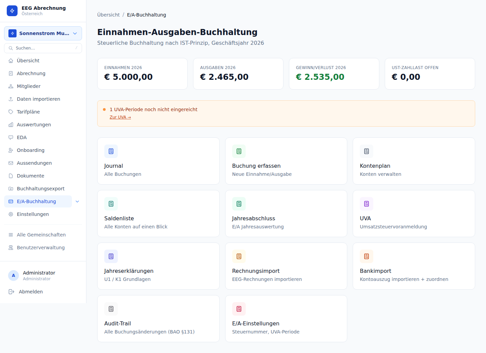

---

## Überblick

Österreichische Energiegemeinschaften sind als **Verein** organisiert. Der laufende Energiebetrieb gilt steuerrechtlich als **wirtschaftlicher Geschäftsbetrieb** des Vereins und ist körperschaftsteuerpflichtig. Solange der Jahresumsatz **unter € 700.000** liegt, darf statt der doppelten Buchführung die vereinfachte **Einnahmen-Ausgaben-Rechnung (EAR)** nach §4 Abs. 3 EStG angewendet werden — es wird lediglich der Überschuss der Einnahmen über die Ausgaben ermittelt.

Das E/A-Buchhaltungsmodul von eegabrechnung ist speziell auf diese Anforderungen zugeschnitten:

- **EAR nach EStG §4 Abs. 3** — Zahlungsorientierte Buchführung (Zufluss-Abfluss-Prinzip)
- **Umsatzsteuervoranmeldung (UVA)** — Automatische Kennzahlenberechnung und FinanzOnline XML-Export
- **Jahreserklärungen** — U1 (USt-Jahreserklärung) und K1/K2 (Körperschaftsteuer-Erklärung für den wirtschaftlichen Geschäftsbetrieb)
- **BAO §131 konform** — Lückenloser Audit-Trail, Soft-Delete, Änderungsprotokoll
- **Bankabgleich** — Import von MT940/CAMT.053-Kontoauszügen mit Buchungsmatching
- **Rechnungsimport** — EEG-Abrechnungsrechnungen werden automatisch als Buchungen übernommen

Das Modul ist für Energiegemeinschaften konzipiert, die als Verein mit wirtschaftlichem Geschäftsbetrieb geführt werden und die EAR-Methode (bis € 700.000 Jahresumsatz) anwenden. Für andere Rechtsformen (z. B. Genossenschaft, GmbH) wenden Sie sich bitte an Ihren Steuerberater.

---

## Voraussetzungen & Einrichtung

Vor der ersten Nutzung müssen die **EA-Einstellungen** hinterlegt werden.

**Seite:** `/eegs/{eegId}/ea/settings`

| Feld | Beschreibung | Beispiel |
|------|-------------|---------|
| **Steuernummer** | Steuernummer der EEG beim zuständigen Finanzamt | `12 345/6789` |
| **Finanzamt** | Bezeichnung des zuständigen Finanzamts | `Finanzamt Österreich` |
| **UVA-Periodentyp** | Voranmeldungszeitraum laut FinanzOnline-Bescheid | `monatlich` oder `vierteljährlich` |

Die Steuernummer wird auf dem FinanzOnline XML-Export eingetragen. Ohne eingetragene Steuernummer kann der UVA-Export nicht eingereicht werden.

Der UVA-Periodentyp muss mit dem im FinanzOnline-Bescheid festgelegten Voranmeldungszeitraum übereinstimmen. Eine nachträgliche Änderung wirkt sich nur auf neue UVA-Perioden aus — bereits erstellte Perioden bleiben unverändert.

---

## Kontenplan

Der Kontenplan bildet das Rückgrat der Buchführung. Jede Buchung ist genau einem Konto zugeordnet.

**Seite:** `/eegs/{eegId}/ea/konten`

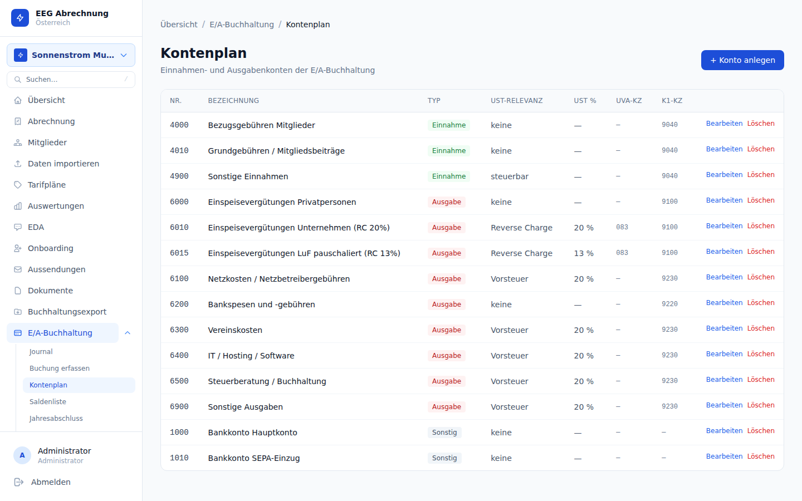

### Konto anlegen und bearbeiten

| Feld | Beschreibung | Pflichtfeld |
|------|-------------|------------|
| **Nummer** | Freie Kontonummer (z. B. nach SKR-Schema) | Ja |
| **Bezeichnung** | Klartextname des Kontos | Ja |
| **Richtung** | `einnahme` oder `ausgabe` | Ja |
| **USt-Code** | Voreingestellter Umsatzsteuer-Code für Buchungen auf diesem Konto | Nein |
| **K1-Kennzahl** | Zuordnung zur FinanzOnline K1-Kennzahl (automatisch vorbelegt) | Nein |

### USt-Codes

| Code | Bedeutung | Kennzahl |
|------|-----------|---------|
| `U20` | 20 % Umsatzsteuer (Regelsteuersatz) | KZ 022 |
| `U10` | 10 % Umsatzsteuer (ermäßigter Satz) | KZ 044 |
| `U0` | 0 % / steuerbefreit | — |
| `RC` | Reverse Charge §19 UStG (Steuerschuldumkehr, innerstaatlich) | KZ 057 |
| `IG` | Innergemeinschaftliche Lieferung/Leistung | — |
| `EN` | Eigenverbrauch | — |

Der USt-Code am Konto dient als Voreinstellung und kann beim Erfassen einer Buchung überschrieben werden. Für Energielieferungen innerhalb der EEG ist in der Regel `U20` (Regelbesteuerung) oder `U0` (Kleinunternehmer) zutreffend.

### K1-Kennzahl

Die K1-Kennzahl ordnet ein Konto einer Zeile in der **Körperschaftsteuer-Erklärung K1** (FinanzOnline) zu. Die Zuordnung wird beim Anlegen eines Kontos aus einer Standardliste vorbelegt und kann manuell angepasst werden.

Konten ohne K1-Kennzahl erscheinen nicht in der automatisch generierten K1-Exportdatei. Für die meisten EEGs genügen wenige Standardkonten (Mitgliedsbeiträge, Energieerlöse, laufende Betriebsausgaben).

---

## Buchungen erfassen

Manuelle Buchungen werden über das Journal oder direkt über den Button **Neue Buchung** erstellt.

**Seite:** `/eegs/{eegId}/ea/buchungen/neu`

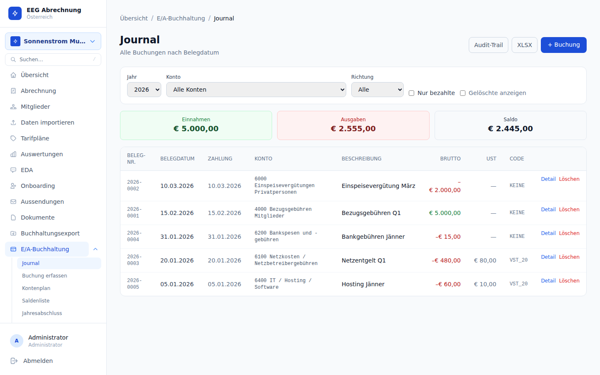

### Felder einer Buchung

| Feld | Beschreibung | Pflichtfeld |
|------|-------------|------------|
| **Belegdatum** | Datum des Belegs (Rechnungsdatum, Quittungsdatum) | Ja |
| **Zahlungsdatum** | Tatsächliches Zahlungsdatum (Zahlungseingang oder -ausgang) | Nein |
| **Konto** | Zugeordnetes Konto aus dem Kontenplan | Ja |
| **Richtung** | `einnahme` oder `ausgabe` (wird vom Konto vorbelegt) | Ja |
| **Betrag Brutto** | Brutto-Betrag in EUR inkl. USt. | Ja |
| **USt-Code** | Umsatzsteuer-Behandlung (wird vom Konto vorbelegt) | Ja |
| **Beschreibung** | Buchungstext / Verwendungszweck | Ja |
| **Gegenseite** | Name des Geschäftspartners (Lieferant, Auftraggeber etc.) | Nein |
| **Notizen** | Interne Anmerkungen | Nein |

Das Zahlungsdatum ist für die UVA-Kennzahlenberechnung entscheidend: UVA-Kennzahlen werden nach dem Zahlungseingang/-ausgang berechnet (Istversteuerung / Zahlungseingang-Methode). Tragen Sie das Zahlungsdatum daher korrekt ein, sobald die Zahlung erfolgt ist.

Buchungen können nach dem Speichern bearbeitet werden, werden aber gemäß BAO §131 in einem unveränderlichen Changelog protokolliert. Das vollständige Löschen einer Buchung ist nicht möglich — nur Soft-Delete mit Löschgrund ist zulässig (siehe Abschnitt Audit-Trail).

### Journal und Filter

Das Journal unter `/eegs/{eegId}/ea/buchungen` zeigt alle Buchungen und bietet folgende Filter:

| Filter | Beschreibung |
|--------|-------------|
| **Jahr** | Filtert nach Belegjahr |
| **Konto** | Einschränkung auf ein bestimmtes Konto |
| **Richtung** | Nur Einnahmen oder nur Ausgaben anzeigen |
| **Bezahlt** | Nur bereits bezahlte Buchungen (Zahlungsdatum gesetzt) |
| **inkl. gelöscht** | Zeigt auch soft-gelöschte Buchungen (für Revision) |

Der **XLSX-Export** lädt alle gefilterten Buchungen als Excel-Datei herunter.

---

## Belegverwaltung

Zu jeder Buchung können beliebig viele digitale Belege (PDFs, Scans, Fotos) hochgeladen werden.

**Seite:** `/eegs/{eegId}/ea/buchungen/{buchungId}`

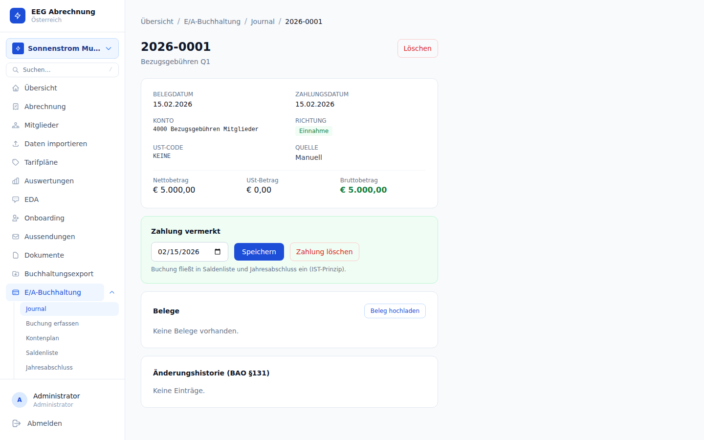

### Beleg hochladen

1. Buchungsdetail öffnen
2. Im Bereich **Belege** auf **Beleg hochladen** klicken
3. Datei auswählen (PDF, JPG, PNG etc.)
4. Der Beleg ist sofort abrufbar und im Audit-Trail sichtbar

### Beleg herunterladen und löschen

- Klick auf den Dateinamen lädt den Beleg herunter
- Das Löschen eines Belegs ist möglich, solange die zugehörige Buchung aktiv ist

Belege sollten zeitnah hochgeladen werden. Die Verknüpfung von Buchung und Originalbeleg ist Voraussetzung für eine ordnungsgemäße Buchführung nach BAO §131.

---

## Rechnungen importieren

EEG-Abrechnungsrechnungen aus finalisierten Abrechnungsläufen können automatisch als Buchungen importiert werden — manuelles Nachbuchen entfällt.

**Seite:** `/eegs/{eegId}/ea/import`

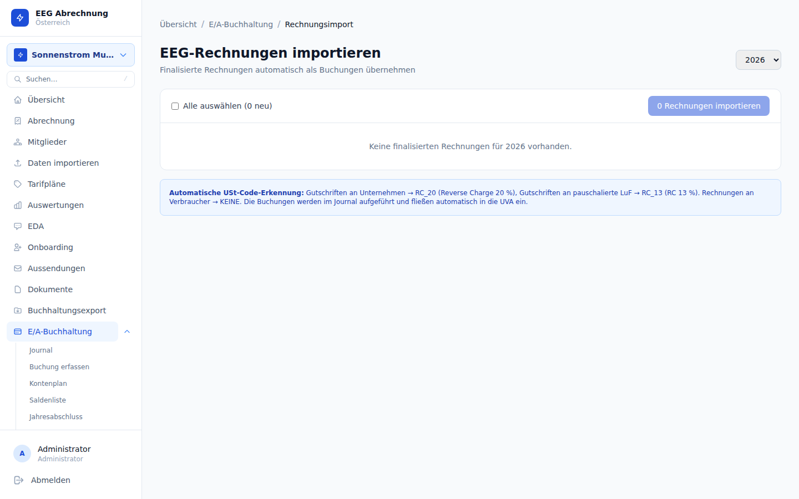

### Ablauf

1. Seite **Import** aufrufen
2. **Jahr** auswählen — das System zeigt eine Vorschau aller Rechnungen, die noch nicht importiert wurden
3. Rechnungen auswählen oder alle mit einem Klick markieren
4. **Importieren** bestätigen — das System legt für jede Rechnung eine Buchung an

### Was wird importiert?

| Feld der Buchung | Quelle aus Rechnung |
|-----------------|-------------------|
| Belegdatum | Rechnungsdatum |
| Betrag Brutto | Brutto-Gesamtbetrag der Rechnung |
| Beschreibung | Rechnungsnummer + Mitgliedsname |
| Gegenseite | Name des Mitglieds |
| Konto | Standardkonto für Energieerlöse (aus Kontenplan) |
| USt-Code | Entsprechend dem auf der Rechnung angewandten USt-Satz |

Importierte Rechnungen werden in der Vorschau beim nächsten Aufruf nicht mehr angezeigt. Ein doppelter Import ist damit ausgeschlossen.

Stornierte Rechnungen werden vom Importvorschlag ausgeschlossen. Wurden Rechnungen nach dem Import storniert, muss die entsprechende Buchung manuell gelöscht (Soft-Delete) oder storniert werden.

---

## Bankkontoauszug importieren

Kontoauszüge der EEG-Bankverbindung können direkt in die Buchhaltung importiert werden. Das System erkennt Zahlungseingänge und -ausgänge automatisch und ermöglicht das Matchen mit bestehenden Buchungen.

**Seite:** `/eegs/{eegId}/ea/bank`

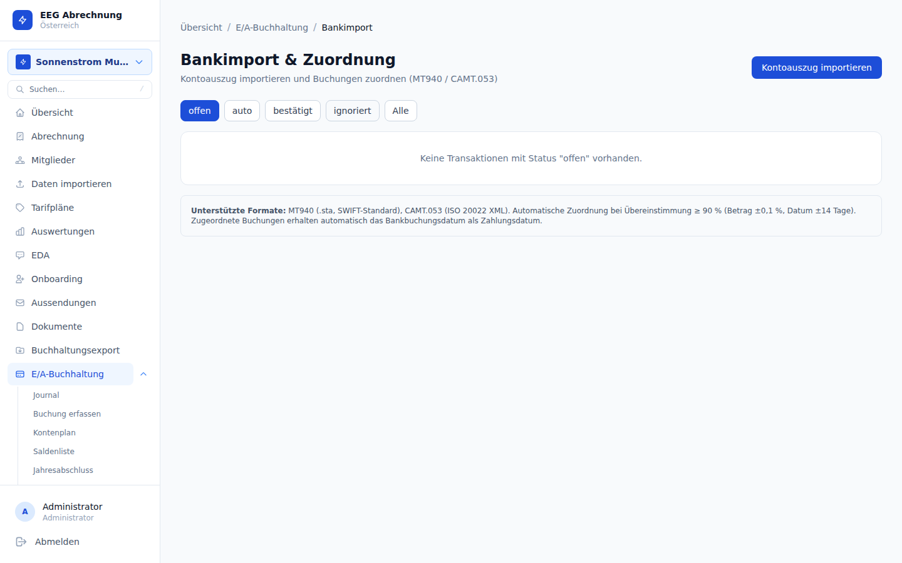

### Unterstützte Formate

| Format | Beschreibung | Typischer Anbieter |
|--------|-------------|-------------------|
| **MT940** | SWIFT-Standard für Kontoauszüge | Raiffeisenbank, Erste Bank, Sparkasse |
| **CAMT.053** | ISO 20022 XML-Format | Moderene Bankschnittstellen (SEPA) |

### Import-Ablauf

1. Kontoauszugsdatei von der Bankwebseite herunterladen
2. Seite **Bank** → **Kontoauszug importieren** aufrufen
3. Datei auswählen und **Format** wählen (`mt940` oder `camt053`)
4. Das System zeigt alle importierten Transaktionen mit Status `offen`

### Transaktionen matchen

Nach dem Import werden Transaktionen den bestehenden Buchungen zugeordnet:

| Aktion | Beschreibung |
|--------|-------------|
| **Matchen** | Transaktion mit einer vorhandenen Buchung verknüpfen; Status wechselt zu `bestaetigt` |
| **Ignorieren** | Transaktion als nicht relevant markieren (z. B. interne Umbuchung); Status `ignoriert` |

### Transaktionsstatus

| Status | Bedeutung |
|--------|-----------|
| `offen` | Noch nicht zugeordnet |
| `auto` | Automatisch zugeordnet (Betrag + Datum stimmen überein) |
| `bestaetigt` | Manuell bestätigt |
| `ignoriert` | Bewusst ausgeblendet |

Regelmäßiger Kontoauszugsimport (monatlich oder nach Zahlungseingang) erleichtert die Abstimmung vor der UVA-Abgabe erheblich.

---

## Auswertungen

### Saldenliste

Die Saldenliste zeigt für jedes Konto den kumulierten Saldo im gewählten Jahr.

**Seite:** `/eegs/{eegId}/ea/saldenliste`

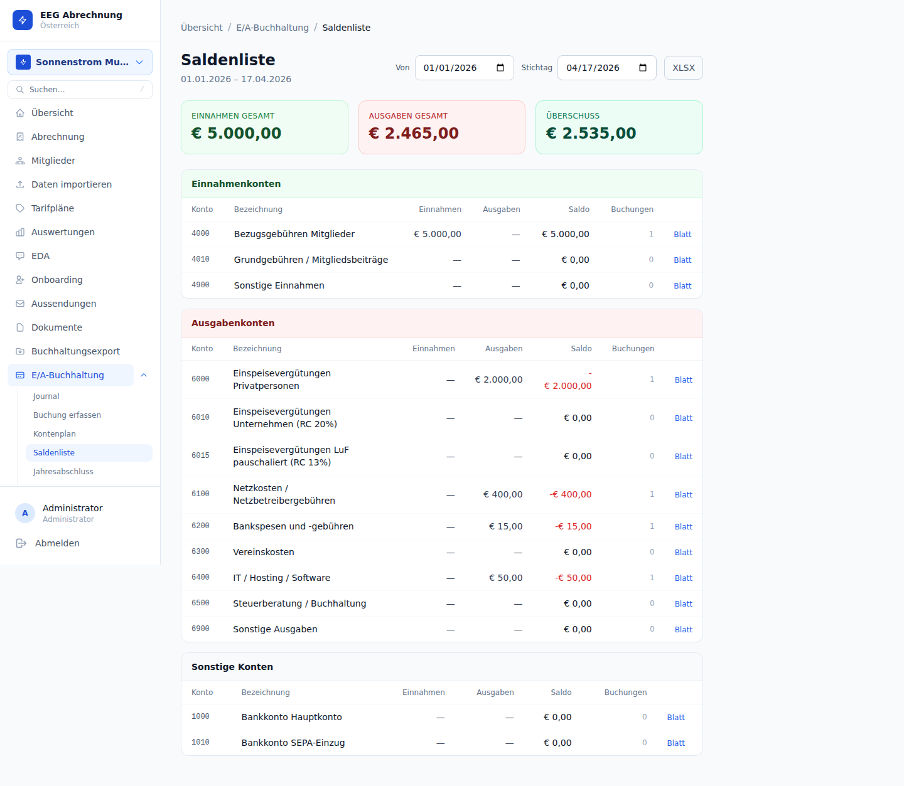

| Spalte | Bedeutung |
|--------|-----------|
| **Kontonummer** | Nummer aus dem Kontenplan |
| **Bezeichnung** | Name des Kontos |
| **Richtung** | Einnahme oder Ausgabe |
| **Summe** | Summe aller Buchungen auf diesem Konto im gewählten Jahr |

Die Saldenliste kann als **XLSX** exportiert werden.

---

### Kontenblatt

Das Kontenblatt zeigt alle Buchungen eines einzelnen Kontos mit laufendem Saldo.

**Seite:** `/eegs/{eegId}/ea/kontenblatt/{kontoId}`

**Parameter:** Von- und Bis-Datum (beliebiger Zeitraum, nicht auf Jahresgrenzen beschränkt)

| Spalte | Bedeutung |
|--------|-----------|
| **Datum** | Belegdatum der Buchung |
| **Beschreibung** | Buchungstext |
| **Betrag** | Brutto-Betrag der Buchung |
| **Laufender Saldo** | Kumulierter Saldo von Beginn des Zeitraums bis zur jeweiligen Zeile |

Das Kontenblatt eignet sich zur Überprüfung einzelner Konten vor der UVA-Abgabe oder dem Jahresabschluss.

---

### Jahresabschluss (EAR)

Der Jahresabschluss stellt die **Einnahmen-Ausgaben-Überschussrechnung** für ein Geschäftsjahr dar.

**Seite:** `/eegs/{eegId}/ea/jahresabschluss`

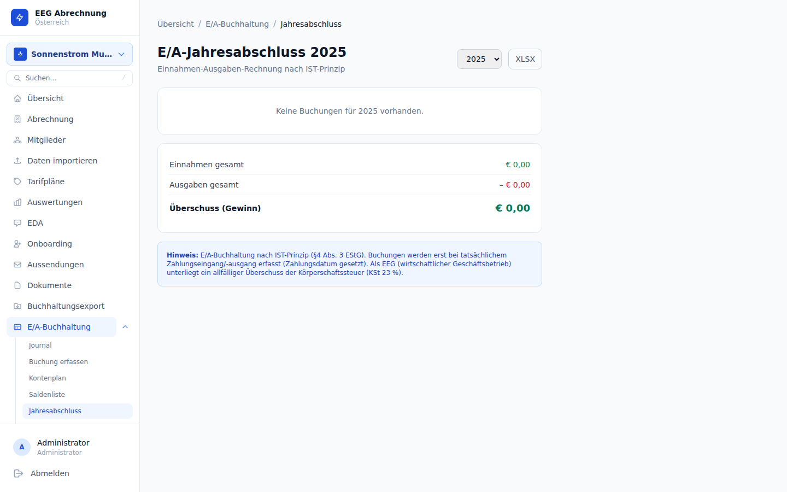

| Bereich | Inhalt |
|---------|--------|
| **Einnahmen** | Summe aller Buchungen auf Einnahmekonten |
| **Ausgaben** | Summe aller Buchungen auf Ausgabekonten |
| **Überschuss** | Differenz Einnahmen minus Ausgaben |

**Exportmöglichkeiten:**

| Export | Beschreibung |
|--------|-------------|
| **XLSX** | Excel-Tabelle mit aufgeschlüsselten Einnahmen/Ausgaben nach Konto |
| **K2 XML** | FinanzOnline XML-Export für die Körperschaftsteuer-Erklärung K2 (wirtschaftlicher Geschäftsbetrieb) |

Der K2 XML-Export folgt dem BMF-Schema `BMF_XSD_Jahreserklaerungen_2025.xsd`. Die erzeugte Datei kann direkt in FinanzOnline hochgeladen werden.

Der K2-Export enthält nur Konten mit hinterlegter K1-Kennzahl. Überprüfen Sie vor dem Export im Kontenplan, dass alle relevanten Konten korrekt zugeordnet sind.

---

## UVA (Umsatzsteuer-Voranmeldung)

Die Umsatzsteuer-Voranmeldung (UVA) muss monatlich oder vierteljährlich über FinanzOnline eingereicht werden (abhängig vom Umsatz und dem Bescheid des Finanzamts).

**Seite:** `/eegs/{eegId}/ea/uva`

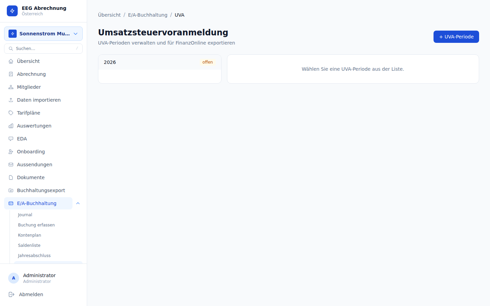

### UVA-Periode anlegen

1. Seite **UVA** aufrufen
2. **Neue Periode** anlegen
3. Von- und Bis-Datum der UVA-Periode eingeben (z. B. 2025-01-01 bis 2025-03-31 für Q1)
4. Das System berechnet automatisch alle Kennzahlen aus den vorhandenen Buchungen

### UVA-Kennzahlen

| Kennzahl | Bedeutung | Berechnungsgrundlage |
|----------|-----------|---------------------|
| **KZ 020** | Gesamtumsatz (20 % USt) | Einnahmen mit USt-Code `U20` |
| **KZ 022** | Steuer auf KZ 020 (20 %) | KZ 020 × 20 % |
| **KZ 029** | Abziehbare Vorsteuer | Ausgaben mit `U20`, `U10`, `RC` |
| **KZ 044** | Umsatz zu 10 % USt | Einnahmen mit USt-Code `U10` |
| **KZ 057** | Reverse Charge §19 (innerstaatlich) | Buchungen mit USt-Code `RC` |

Die Kennzahlen werden auf Basis des **Zahlungsdatums** berechnet (Istversteuerung). Buchungen ohne Zahlungsdatum fließen erst in die UVA ein, wenn das Zahlungsdatum nachgetragen wird.

### FinanzOnline XML-Export

1. UVA-Periode öffnen
2. **XML exportieren** klicken — das System erzeugt eine XML-Datei nach dem aktuellen BMF-Schema
3. XML-Datei in **FinanzOnline** hochladen (Menü: Eingaben → Umsatzsteuer → Voranmeldung)
4. Nach erfolgreicher Einreichung: **Als eingereicht markieren** im System

Das „Als eingereicht markieren" ist ein manueller Schritt und hat keine direkte Verbindung zu FinanzOnline. Er dient der internen Nachverfolgung, damit die UVA nicht versehentlich ein zweites Mal übermittelt wird.

---

## Jahressteuererklärungen

**Seite:** `/eegs/{eegId}/ea/erklaerungen`

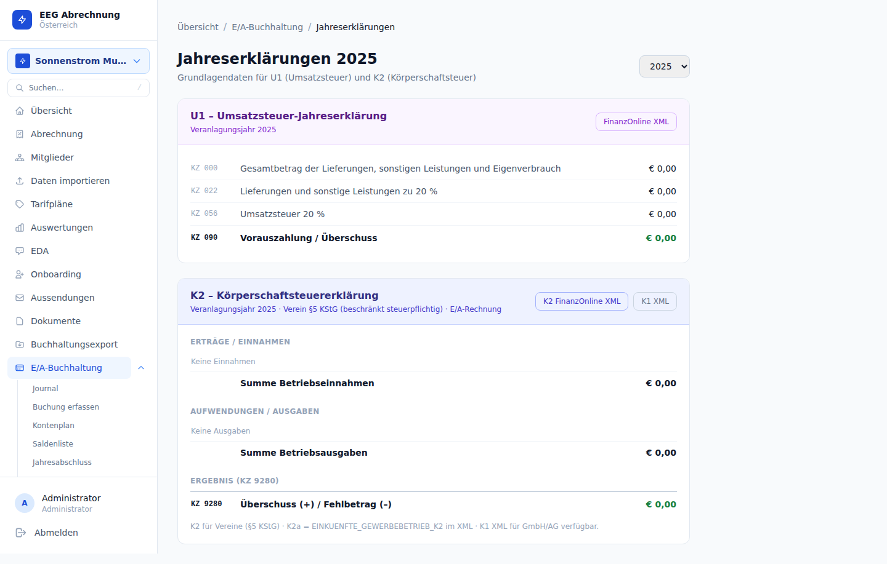

Das System unterstützt die Aufbereitung zweier jährlicher Steuererklärungen:

### U1 — Umsatzsteuer-Jahreserklärung

Die U1 fasst alle UVA-Perioden eines Jahres zusammen und liefert die Gesamtwerte für die Umsatzsteuer-Jahreserklärung:

| Kennzahl | Bedeutung |
|----------|-----------|
| Gesamtumsatz | Summe aller steuerpflichtigen Umsätze des Jahres |
| Gesamte Umsatzsteuer | Summe der abzuführenden USt. |
| Gesamte Vorsteuer | Summe der abziehbaren Vorsteuer |
| USt-Zahllast / Überschuss | Differenz aus USt. und Vorsteuer |

### K1 — Körperschaftsteuer-Basis (wirtschaftlicher Geschäftsbetrieb)

Die K1-Ansicht zeigt die für die Körperschaftsteuer-Erklärung relevanten Beträge des wirtschaftlichen Geschäftsbetriebs, aufgegliedert nach K1-Kennzahlen:

| Spalte | Bedeutung |
|--------|-----------|
| K1-Kennzahl | Zeile der KöSt-Erklärung |
| Konten | Zugeordnete Konten |
| Betrag | Summe aller Buchungen auf diesen Konten |

Die K1-Daten fließen automatisch in den K2 XML-Export (Jahresabschlussbereich) ein. Überprüfen Sie die K1-Übersicht, bevor Sie den K2 XML-Export einreichen.

Der Energiebetrieb einer EEG gilt als wirtschaftlicher Geschäftsbetrieb und ist körperschaftsteuerpflichtig — eine Steuerbefreiung gibt es hier nicht. Die jährliche K2-Erklärung muss beim Finanzamt eingereicht werden. Lassen Sie die steuerliche Einordnung von einem Steuerberater bestätigen.

---

## Audit-Trail (BAO §131)

Die Bundesabgabenordnung §131 schreibt vor, dass Bücher und Aufzeichnungen so geführt werden müssen, dass ein sachverständiger Dritter in angemessener Zeit die Buchführung prüfen und den Zusammenhang zwischen Belegen und Buchungen nachvollziehen kann. Außerdem dürfen Eintragungen nicht nachträglich unleserlich gemacht oder verändert werden.

**Seite (Buchungs-Changelog):** `/eegs/{eegId}/ea/buchungen/{buchungId}`
**Seite (EEG-weiter Changelog):** `/eegs/{eegId}/ea/changelog`

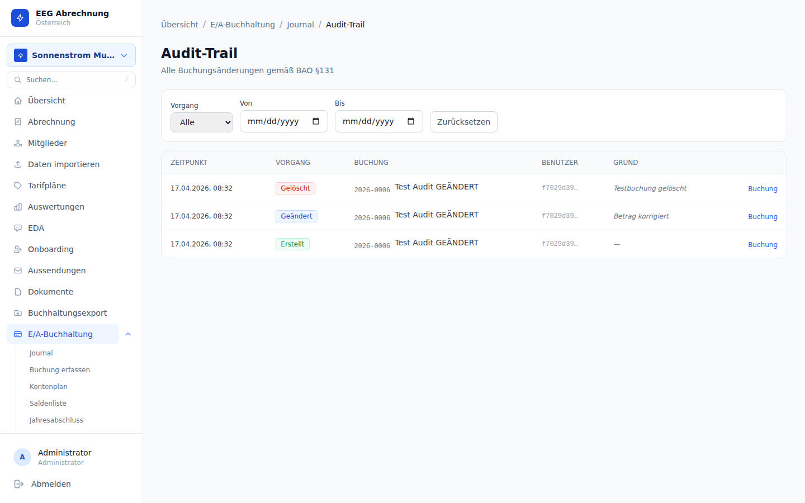

### Soft-Delete statt Löschen

Buchungen können nicht endgültig gelöscht werden. Stattdessen werden sie **soft-gelöscht**:

- Das Feld `deleted_at` wird gesetzt
- Das Feld `deleted_by` speichert die E-Mail-Adresse des löschenden Benutzers
- Ein Changelog-Eintrag mit der alten Buchung als JSON-Snapshot wird angelegt
- Im Journal sind soft-gelöschte Buchungen standardmäßig ausgeblendet — mit dem Filter **inkl. gelöscht** werden sie angezeigt

**Beim Löschen kann ein optionaler Löschgrund angegeben werden**, der im Changelog gespeichert wird.

Soft-gelöschte Buchungen fließen nicht mehr in UVA-Kennzahlen, Saldenlisten oder den Jahresabschluss ein. Sie bleiben aber dauerhaft im System und im Audit-Trail sichtbar — eine Wiederherstellung ist durch den Steuerberater/Administrator möglich.

### Buchungs-Changelog

Jede Änderung an einer Buchung (Anlegen, Bearbeiten, Löschen) wird automatisch protokolliert:

| Feld | Inhalt |
|------|--------|
| **Operation** | `create`, `update` oder `delete` |
| **Zeitpunkt** | UTC-Timestamp der Änderung |
| **Benutzer** | E-Mail-Adresse des ändernden Benutzers |
| **Alter Wert** | JSON-Snapshot der Buchung vor der Änderung |
| **Neuer Wert** | JSON-Snapshot der Buchung nach der Änderung |
| **Grund** | Optionaler Änderungs-/Löschgrund |

### EEG-weiter Changelog

Der EEG-weite Changelog unter `/eegs/{eegId}/ea/changelog` zeigt alle Buchungs-Mutationen aller Buchungen der EEG und kann gefiltert werden:

| Filter | Beschreibung |
|--------|-------------|
| **Von / Bis** | Zeitraum der Änderung |
| **Benutzer** | Einschränkung auf eine bestimmte Benutzer-UUID |
| **Operation** | `create`, `update` oder `delete` |
| **Limit / Offset** | Paginierung (Standard: 200 Einträge, Maximum: 500) |

Der Changelog ist nicht löschbar und nicht editierbar. Er stellt den gesetzlich vorgeschriebenen Revisionspfad nach BAO §131 dar. Bei einer Betriebsprüfung kann der vollständige Changelog als Nachweis für die ordnungsgemäße Führung der Bücher vorgelegt werden.

---

## Empfohlener Jahresablauf

Der folgende Ablauf beschreibt einen typischen Buchführungszyklus für eine österreichische Energiegemeinschaft:

| Zeitpunkt | Aufgabe |
|-----------|---------|
| **Monatlich / Quartalsweise** | Kontoauszug importieren (Bank) |
| **Monatlich / Quartalsweise** | Neue Buchungen erfassen oder Rechnungen importieren |
| **Bis 15. des Folgemonats** | UVA-Periode anlegen, Kennzahlen prüfen, XML exportieren und in FinanzOnline einreichen |
| **Nach UVA-Einreichung** | Periode im System als eingereicht markieren |
| **Jänner des Folgejahres** | Jahresabschluss (EAR) erstellen, XLSX und K2 XML exportieren |
| **30. April** | K2-Erklärung über FinanzOnline einreichen (Frist beachten!) |
| **30. April** | U1-Erklärung über FinanzOnline einreichen |

Die Abgabefristen für die Jahreserklärungen (K2, U1) können sich je nach FinanzOnline-Bescheid oder bei Inanspruchnahme der Quotenregelung (Steuerberater) verschieben. Klären Sie die konkreten Fristen mit Ihrem Steuerberater.

Energiegemeinschaften mit einem Jahresumsatz über 700.000 EUR sind zur **doppelten Buchführung** und Bilanzierung verpflichtet. Das EAR-Modul ist für Vereine unterhalb dieser Schwelle konzipiert. Übersteigt der Umsatz diese Grenze, ist ein Steuerberater hinzuzuziehen.

